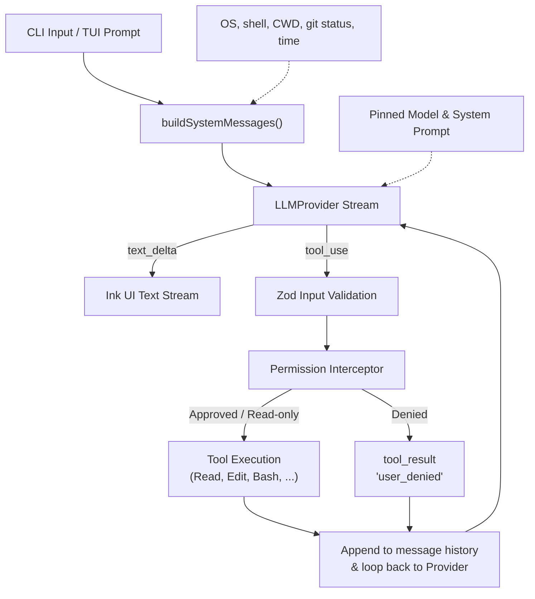
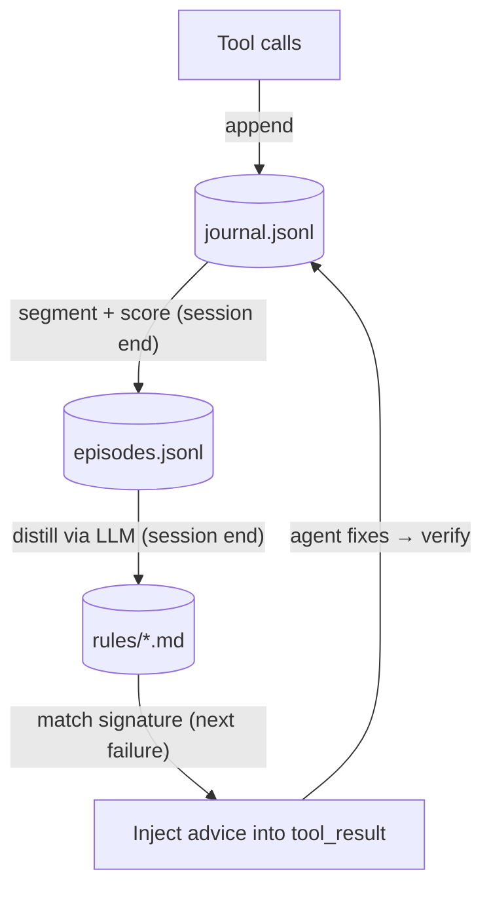
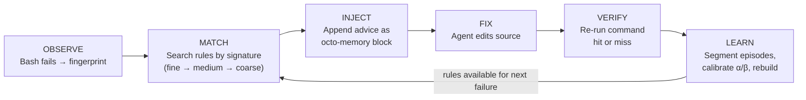

# Octonoesis 🐙

An open-source, lightweight, and lightning-fast terminal coding agent designed to read code, search directories, edit files with unified diff approvals, run tests, and automatically execute commands to fulfill natural-language tasks.

Built entirely in TypeScript on the **Bun** runtime using **Ink** for a rich, responsive Terminal User Interface (TUI).

---

## Architecture Flow



---

## Features

- **Standardized Tool System**: Executes tools serially with strict parameter validation (Zod) and sandbox safety boundaries (paths must remain within the repository root).
- **Interactive Permission UI**: Prompts for `[y] yes / [n] no / [a] always` on modifying actions (like `Edit` or `Bash`), complete with colorful unified diff previews.
- **Robust Cancellation & Retry**: Interrupt running processes and model streams cleanly with `Ctrl+C`. Handles rate limits (429) and server drops (5xx) with exponential backoff and jitter.
- **Provider Abstraction**: First-class tested support for Anthropic Claude, OpenAI GPT-4o, and DeepSeek, with easy endpoint configuration.
- **Dynamic Context Suffix**: Computes runtime environment status (OS, Shell, Git porcelain status, Time, Token usage) to ground LLM context dynamically.

---

## Installation

### Prerequisites
- **Bun** (version `>= 1.2.0` is required). To install Bun:
  ```bash
  curl -fsSL https://bun.sh/install | bash
  ```
- **ripgrep** (optional fallback; recommended if prebuilt `@vscode/ripgrep` is blocked by system policies):
  ```bash
  # macOS
  brew install ripgrep
  # Debian/Ubuntu
  sudo apt-get install ripgrep
  ```

### Install Globally
```bash
bun install -g octonoesis
```

---

## Quickstart (5 Minutes)

1. Set your API Key in your environment:
   ```bash
   # For Anthropic (default)
   export ANTHROPIC_API_KEY="your-api-key"

   # For OpenAI
   export LLM_PROVIDER="openai"
   export OPENAI_API_KEY="your-api-key"
   ```

2. Run the agent in one of two modes:
   - **Interactive TUI Mode**:
     ```bash
     octonoesis
     ```
     This launches a full terminal dashboard showing the LLM conversation stream on the left, and a live in-memory TODO status panel on the right.
   
   - **One-shot Mode**:
     ```bash
     octonoesis "Fix the spelling mistake in src/utils/errors.ts"
     ```
     This streams the solution directly to standard output and exits.

---

## Learning Loop

Octonoesis includes a built-in learning loop that observes how the agent resolves errors and distills reusable rules from those episodes. Unlike self-assessment approaches, every rule is grounded in **externally verified outcomes** — a rule only earns credit when the same `bun test` (or equivalent command) that originally failed comes back passing.

### Architecture



Three persistence layers form the loop:

- **Journal**: Every tool call is appended with its fingerprint (a three-level signature: `tool|error_class`, `tool|error_class|file`, `tool|error_class|file|expression`). The journal is never modified after write.
- **Episodes**: A segment state machine groups journal events into fail→fix→verify cycles. Each episode is scored: `abandoned`, `unattributable`, and `transient` episodes are excluded; `resolved` episodes carry a value score based on attribution confidence.
- **Rules**: The distiller (cheapest available model) reads each eligible episode and outputs a rule file — a markdown document with YAML frontmatter containing trigger signatures, a Beta-distribution confidence prior, and fix advice.

### Injection Cycle



The agent never sees the learning machinery — it just receives contextual advice alongside normal tool output.

### Example Rule File

```yaml
---
id: rule-optional-chaining-null
triggers:
  tools:
    - Bash
  command_prefix:
    - bun test
  error_signatures:
    - Bash|TypeError|src/user.ts|evaluating 'user.name'
scope: repo
alpha: 5
beta: 2
confidence: 0.7143
evidence:
  - ep_0001
  - ep_0014
hits: 3
misses: 0
anchor:
  file: src/user.ts
status: active
---

When `bun test` fails with a TypeError on property access of a potentially null object,
add optional chaining (`?.`) and a nullish coalescing fallback (`?? defaultValue`).
Check the call site — the caller may be passing `null` where the function expects a valid object.
```

### Rule Management

```bash
# List all rules
ls .octonoesis/rules/

# Inspect a rule
cat .octonoesis/rules/rule-optional-chaining-null.md

# Delete a rule (it won't come back unless its episode still exists at next rebuild)
rm .octonoesis/rules/rule-optional-chaining-null.md

# Force full rebuild from episodes
octonoesis rebuild-rules --force

# View calibration statistics
octonoesis --stats
```

Example `--stats` output:

```
Bucket                          | Observations | Posterior Mean | 95% Credible Interval | Recommendation
--------------------------------+--------------+----------------+-----------------------+-----------------
Bash|TypeError                  | 24           | 72%            | [58% - 84%]           | confident
Bash|SyntaxError                | 18           | 65%            | [48% - 80%]           | confident
Bash|ReferenceError             | 15           | 68%            | [49% - 84%]           | confident
Bash|ImportError                | 12           | 61%            | [40% - 80%]           | uncertain
Bash|AssertionError             | 20           | 58%            | [42% - 73%]           | ⚠ review recommended
```

### Pool and Lifecycle

The rule pool is capped at **150 active + candidate** rules. When the cap is exceeded, rules are scored by `specificity × confidence × timeDecay` and the lowest-scored are retired (files stay on disk but stop matching). Lifecycle transitions: candidate → active (confidence ≥ 0.55, lower CI > 0.3), active → retired (upper CI < 0.45 or anchor file deleted), pinned/banned are immune.

### Validation

Phase 19 validated the learning loop across six dimensions:

| Test Suite | What It Covers | Scale |
|------------|---------------|-------|
| Fixture corpus | 15 error scenarios across 7 coarse buckets | 150 fixtures |
| Cross-pattern generalization | Rules from one instance fix other instances of same type | ~75 sessions incl. 5 negative-transfer checks |
| Evidence chain integrity | Rule→Episode→Journal provenance is intact for all rules | 5 representative full-pipeline runs |
| Negative controls | 8 failure modes: no-error, non-fingerprinted, miss, permission-deny, abandoned, transient, banned, dedup | 24 runs (8 × 3 seeded random types) |
| Calibration accumulation | Beta posterior convergence over increasing observations | 196 calibration records across 15 buckets |
| Rebuild + scale benchmark | 500-episode rebuild, pool cap enforcement, matching budget, state preservation, idempotency, real-spawn smoke | 199 assertions |

The real-spawn smoke test (sub-test 7) runs actual `bun test` against 3 materialized fixtures and confirms that the fail→fix→pass cycle works with real tool output, not just mock data.

### Known Limitations

1. **Ceiling effect on simple bugs**: Haiku-tier models solve 3/5 benchmark bug types in 1 turn with 100% success rate, leaving no room for rule injection to help. The learning loop's value is best measured on bugs of moderate difficulty — hard enough that the model sometimes fails, but general enough that advice from one instance transfers to another.
2. **Instance-specific fixes don't generalize well**: ModuleNotFound rules learn a specific import path fix (e.g., `./config-loader` → `./config`) that doesn't transfer to other instances with different import paths. Rules need to capture the *strategy* ("check what modules exist in the directory"), not the specific edit.

### Live A/B Benchmark

`test/demo/live-ab.ts` measures whether rule injection changes real LLM fix behavior. It runs paired control (no rules) vs. treatment (with distilled rule) sessions against materialized fixtures using the cheapest available model.

```bash
# Quick smoke (2 runs, 1 type)
bun run test/demo/live-ab.ts --runs 2 --types NullAccess

# Full benchmark (10 runs × 5 types = 50 pairs)
bun run test/demo/live-ab.ts --runs 10
```

#### Results (Claude Haiku 4.5, 50 pairs)

```
=== Overall (5 types x 10 runs = 50 pairs) ===
| Metric          | Control       | Treatment     | Delta        | p-value  |
|-----------------|---------------|---------------|--------------|----------|
| Turns           | 1.5 ± 1.3     | 1.4 ± 1.1     | +3% ± 60%     | 0.296    |
| Tokens (input)  | 715 ± 619     | 805 ± 496     | +39% ± 94%    | 0.234    |
| Tokens (output) | 213 ± 292     | 200 ± 193     | +25% ± 93%    | 0.524    |
| Success rate    | 45/50         | 44/50         | —             | —        |
```

**No statistically significant improvement.** Per-type breakdown:

| Type | Control | Treatment | Signal |
|------|---------|-----------|--------|
| NullAccess | 10/10, 1.0 turns | 10/10, 1.0 turns | Ceiling — too easy |
| ParseError | 10/10, 1.0 turns | 10/10, 1.0 turns | Ceiling — too easy |
| UndefinedRef | 10/10, 1.0 turns | 10/10, 1.0 turns | Ceiling — too easy |
| ExpectMismatch | 7/10, 2.8 turns | 7/10, 1.8 turns | Mixed — rule helped on C1/C2/B3, hurt on D1/E1 |
| ModuleNotFound | 8/10, 1.8 turns | 7/10, 2.1 turns | Negative — rule too instance-specific |

ExpectMismatch showed the clearest positive signal: individual runs went from 4 turns to 1 turn, and 2 failures became successes. But negative transfer in other runs offset the gains. The learning loop's mechanics are validated — the question is fixture difficulty and rule generality.

---

## License

This project is licensed under the MIT License. See [LICENSE](LICENSE) for details.
