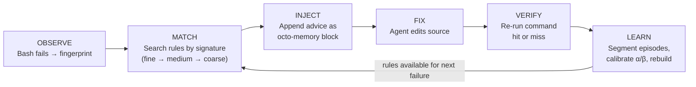
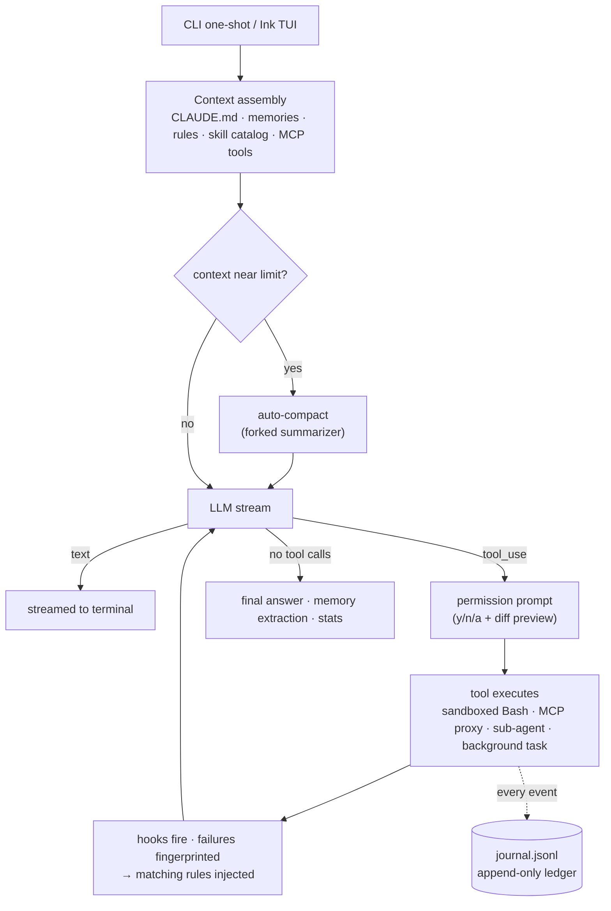

**English** | [简体中文](README.zh-CN.md)

# Octonoesis 🐙

[](https://github.com/PrestoOverture/octonoesis/actions/workflows/ci.yml)
[](LICENSE)

A terminal coding agent that learns from its own mistakes.

Octonoesis reads code, edits files, runs tests, connects to MCP servers, and delegates to sub-agents. The difference is what happens after. Every tool call goes into an append-only journal. Failures get fingerprinted. A state machine segments them into fail→fix→verify episodes, and an LLM distiller turns those into rules — plain markdown files you can read, edit, or delete. Next time the same kind of error comes up, the relevant rules get injected into context. Confidence is earned by evidence (the failing command passes again), not model self-assessment.

TypeScript on **Bun**, **Ink** TUI. One design rule: **the LLM interprets, the harness authorizes.**


---

## Features

**Core**
- 7 built-in tools (Read, Glob, Grep, Edit, Write, Bash, TodoWrite). Zod-validated, serial execution, repo-root confined.
- Interactive TUI and one-shot CLI. Streaming output. `Ctrl+C` to cancel. Retries on 429/5xx with backoff.
- Permission prompt on every mutation — `[y] once / [n] no / [a] always` — with diff preview for edits.
- Claude by default; any OpenAI-compatible endpoint via `LLM_PROVIDER=openai`.

**Context & memory**
- Auto-compaction near the context limit (forked summarizer), so 20+ turn sessions work fine.
- Long-term memory: facts extracted at session end into `.octonoesis/memory/`, recalled per query.
- Project instructions from `CLAUDE.md` (or `OCTONOESIS.md` to override).
- StatusBar shows model, tokens, cost, context %. Stats logged to `.octonoesis/stats.jsonl`.

**Learning loop** — [details below](#learning-loop)

**Extensibility**
- **Skills**: drop a markdown file in `.octonoesis/skills/`, call it as `/my-skill`.
- **Hooks**: shell commands on 6 lifecycle events, time-budgeted.
- **Config**: one file (`.octonoesis/config.json`) for model, MCP servers, hooks, permissions, sandbox. Cloned repos can't run foreign hooks/servers until you opt in.
- **macOS sandbox**: opt-in `sandbox-exec` for Bash, blocking `~/.ssh` and credential stores.

**Integration**
- **MCP**: stdio servers from config, tools namespaced `mcp__{server}__{tool}`.
- **Sub-agents**: read-only child agents (`Agent` tool), prompt cache shared. Background agents run in detached-HEAD worktrees with `SendMessage` steering.
- **Background tasks**: `run_in_background` keeps the conversation going while a command runs. Output to `.octonoesis/tasks/{id}.log`, notification when done.


---

## Learning Loop

Tool calls are journaled with three-level error fingerprints (`tool|error_class`, `+file`, `+expression`). A state machine segments the journal into fail→fix→verify **episodes**. An LLM distiller turns eligible episodes into **rules** — one markdown file each. On the next matching failure, the best rules (max 2) get **injected** with the tool output.

A rule earns confidence only when the command that originally failed passes again. Bayesian Beta posteriors — never model self-assessment.




A rule is just a file:

```yaml
---
id: rule-optional-chaining-null
triggers:
  error_signatures:
    - Bash|TypeError|src/user.ts|evaluating 'user.name'
alpha: 5
beta: 2
confidence: 0.7143
evidence: [ep_0001, ep_0014]
status: active
---

When `bun test` fails with a TypeError on property access of a potentially null object,
add optional chaining (`?.`) and a nullish coalescing fallback (`?? defaultValue`).
Check the call site — the caller may be passing `null` where a valid object is expected.
```

```bash
ls .octonoesis/rules/               # every rule is a file
octonoesis rebuild-rules --force    # regenerate from episodes.jsonl
octonoesis --stats                  # per-bucket Beta posterior + 95% credible interval
```

Active pool caps at 150 rules. When full, they compete on `specificity × confidence × time-decay`. Evidence grows unbounded; beliefs stay bounded.

---

## Installation

**Requirements:**
- **Bun** ≥ 1.2.0 — `curl -fsSL https://bun.sh/install | bash`
- **ripgrep** (optional fallback if bundled `@vscode/ripgrep` can't run)

```bash
bun install -g octonoesis
```

npm / npx work too:

```bash
npm install -g octonoesis
npx octonoesis "Fix the failing test in src/user.ts"
```

**Bun is a runtime dependency**, not just a build tool. The package is a Bun bundle (`#!/usr/bin/env bun`) that won't run under Node — `bun` needs to be on your `PATH` even when installed via npm. For a zero-dependency option, grab a standalone binary from [Releases](https://github.com/PrestoOverture/octonoesis/releases).

## Quickstart

```bash
# Anthropic (default)
export ANTHROPIC_API_KEY="sk-..."

# ...or any OpenAI-compatible endpoint
export LLM_PROVIDER="openai"
export OPENAI_API_KEY="sk-..."
# export OPENAI_BASE_URL="https://api.deepseek.com"
```

```bash
octonoesis                                        # interactive TUI
octonoesis "Fix the failing test in src/user.ts"  # one-shot
octonoesis --sandbox "run the build"              # Bash in macOS sandbox
```

Per-repo config (`.octonoesis/config.json`):

```jsonc
{
  "model": "claude-sonnet-4-6",
  "maxTurns": 30,
  "sandbox": { "enabled": true },
  "mcpServers": {
    "fs": { "command": "bunx", "args": ["--bun", "@modelcontextprotocol/server-filesystem", "/data"] }
  },
  "hooks": [
    { "event": "post_tool_use", "toolPattern": "Bash", "command": "jq -r .outcome >> .hook-log" }
  ]
}
```

---

## API key handling

At startup, Octonoesis captures API keys in module memory and clears them from `process.env`. Subprocesses don't get keys by default — set `OCTONOESIS_INHERIT_API_KEYS=1` to opt in. Fork children (compaction, memory, sub-agents) do get keys since they call the model.

Keys exported by your shell are still visible to same-user processes via OS inspection. Put keys in the repo `.env` instead — Bun loads it directly. The permission prompt on every shell command is the operative security boundary.

---

## Architecture



Three layers: the **journal** is the source of truth (append-only, never edited). **Episodes, rules, and calibration** are derived views — rebuildable from the journal. The **context compiler** assembles per-task packets under token budgets, split into cache-stable system prompt and volatile preamble.

---

## Research & Validation

The learning loop's claims are measured, not asserted. Null and negative results included.

- 150-fixture validation: 15 error scenarios, 7 fingerprint buckets, 24 negative-control runs.
- **Cross-model transfer**: a rule from Claude Haiku lifted gpt-4o-mini from **2/20 to 20/20** on unseen instances (McNemar p<0.001, pre-registered, negative control null).
- **Self-loop**: weak model teaching itself reached 11/20 from 2/20 — real but bounded by distiller quality.
- One negative finding (RepoQuirk) and one methodology lesson (weak-model probes) reported as-is.

Full data: **[reports.md](reports.md)**.

---

## License

MIT — see [LICENSE](LICENSE).
