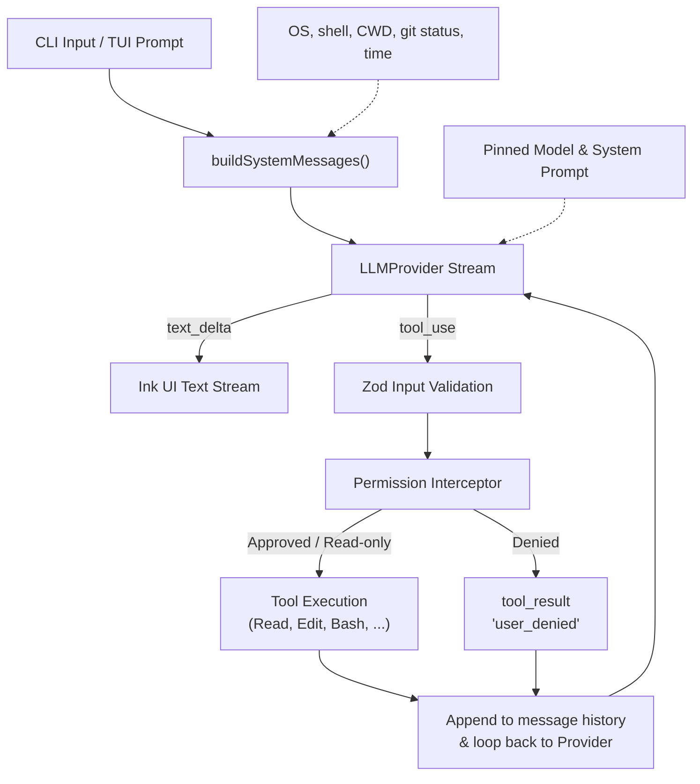
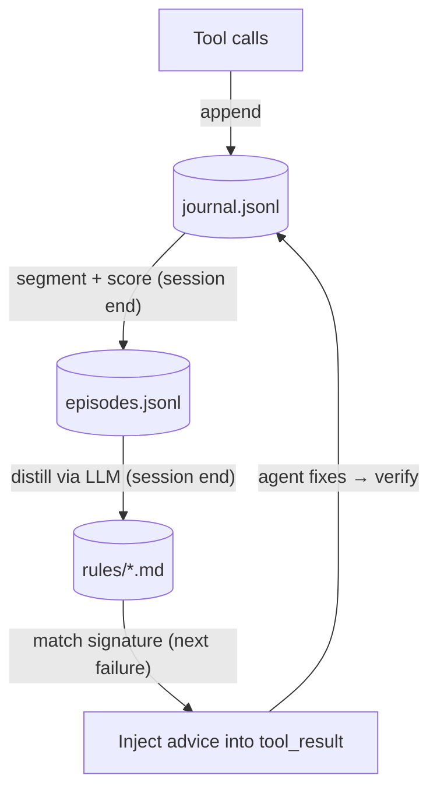
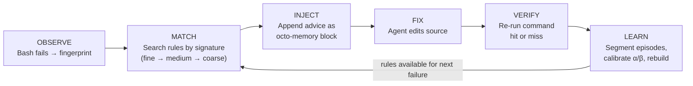

**English** | [简体中文](README.zh-CN.md)

# Octonoesis 🐙

An open-source, lightweight, and lightning-fast terminal coding agent designed to read code, search directories, edit files with unified diff approvals, run tests, and automatically execute commands to fulfill natural-language tasks.

Built entirely in TypeScript on the **Bun** runtime using **Ink** for a rich, responsive Terminal User Interface (TUI).

---

## Architecture Flow



---

## Features

- **Standardized Tool System**: Executes tools serially with strict parameter validation (Zod) and sandbox safety boundaries (paths must remain within the repository root).
- **Interactive Permission UI**: Prompts for `[y] yes / [n] no / [a] always` on modifying actions (like `Edit` or `Bash`), complete with colorful unified diff previews.
- **Robust Cancellation & Retry**: Interrupt running processes and model streams cleanly with `Ctrl+C`. Handles rate limits (429) and server drops (5xx) with exponential backoff and jitter.
- **Provider Abstraction**: First-class tested support for Anthropic Claude, OpenAI GPT-4o, and DeepSeek, with easy endpoint configuration.
- **Dynamic Context Suffix**: Computes runtime environment status (OS, Shell, Git porcelain status, Time, Token usage) to ground LLM context dynamically.

---

## Installation

### Prerequisites
- **Bun** (version `>= 1.2.0` is required). To install Bun:
  ```bash
  curl -fsSL https://bun.sh/install | bash
  ```
- **ripgrep** (optional fallback; recommended if prebuilt `@vscode/ripgrep` is blocked by system policies):
  ```bash
  # macOS
  brew install ripgrep
  # Debian/Ubuntu
  sudo apt-get install ripgrep
  ```

### Install Globally
```bash
bun install -g octonoesis
```

---

## Quickstart (5 Minutes)

1. Set your API Key in your environment:
   ```bash
   # For Anthropic (default)
   export ANTHROPIC_API_KEY="your-api-key"

   # For OpenAI
   export LLM_PROVIDER="openai"
   export OPENAI_API_KEY="your-api-key"
   ```

2. Run the agent in one of two modes:
   - **Interactive TUI Mode**:
     ```bash
     octonoesis
     ```
     This launches a full terminal dashboard showing the LLM conversation stream on the left, and a live in-memory TODO status panel on the right.
   
   - **One-shot Mode**:
     ```bash
     octonoesis "Fix the spelling mistake in src/utils/errors.ts"
     ```
     This streams the solution directly to standard output and exits.

---

## Learning Loop

Octonoesis includes a built-in learning loop that observes how the agent resolves errors and distills reusable rules from those episodes. Unlike self-assessment approaches, every rule is grounded in **externally verified outcomes** — a rule only earns credit when the same `bun test` (or equivalent command) that originally failed comes back passing.

### Architecture



Three persistence layers form the loop:

- **Journal**: Every tool call is appended with its fingerprint (a three-level signature: `tool|error_class`, `tool|error_class|file`, `tool|error_class|file|expression`). The journal is never modified after write.
- **Episodes**: A segment state machine groups journal events into fail→fix→verify cycles. Each episode is scored: `abandoned`, `unattributable`, and `transient` episodes are excluded; `resolved` episodes carry a value score based on attribution confidence.
- **Rules**: The distiller (cheapest available model) reads each eligible episode and outputs a rule file — a markdown document with YAML frontmatter containing trigger signatures, a Beta-distribution confidence prior, and fix advice.

### Injection Cycle



The agent never sees the learning machinery — it just receives contextual advice alongside normal tool output.

### Example Rule File

```yaml
---
id: rule-optional-chaining-null
triggers:
  tools:
    - Bash
  command_prefix:
    - bun test
  error_signatures:
    - Bash|TypeError|src/user.ts|evaluating 'user.name'
scope: repo
alpha: 5
beta: 2
confidence: 0.7143
evidence:
  - ep_0001
  - ep_0014
hits: 3
misses: 0
anchor:
  file: src/user.ts
status: active
---

When `bun test` fails with a TypeError on property access of a potentially null object,
add optional chaining (`?.`) and a nullish coalescing fallback (`?? defaultValue`).
Check the call site — the caller may be passing `null` where the function expects a valid object.
```

### Rule Management

```bash
# List all rules
ls .octonoesis/rules/

# Inspect a rule
cat .octonoesis/rules/rule-optional-chaining-null.md

# Delete a rule (it won't come back unless its episode still exists at next rebuild)
rm .octonoesis/rules/rule-optional-chaining-null.md

# Force full rebuild from episodes
octonoesis rebuild-rules --force

# View calibration statistics
octonoesis --stats
```

Example `--stats` output:

```
Bucket                          | Observations | Posterior Mean | 95% Credible Interval | Recommendation
--------------------------------+--------------+----------------+-----------------------+-----------------
Bash|TypeError                  | 24           | 72%            | [58% - 84%]           | confident
Bash|SyntaxError                | 18           | 65%            | [48% - 80%]           | confident
Bash|ReferenceError             | 15           | 68%            | [49% - 84%]           | confident
Bash|ImportError                | 12           | 61%            | [40% - 80%]           | uncertain
Bash|AssertionError             | 20           | 58%            | [42% - 73%]           | ⚠ review recommended
```

### Pool and Lifecycle

The rule pool is capped at **150 active + candidate** rules. When the cap is exceeded, rules are scored by `specificity × confidence × timeDecay` and the lowest-scored are retired (files stay on disk but stop matching). Lifecycle transitions: candidate → active (confidence ≥ 0.55, lower CI > 0.3), active → retired (upper CI < 0.45 or anchor file deleted), pinned/banned are immune.

### Validation

Phase 19 validated the learning loop across six dimensions:

| Test Suite | What It Covers | Scale |
|------------|---------------|-------|
| Fixture corpus | 15 error scenarios across 7 coarse buckets | 150 fixtures |
| Cross-pattern generalization | Rules from one instance fix other instances of same type | ~75 sessions incl. 5 negative-transfer checks |
| Evidence chain integrity | Rule→Episode→Journal provenance is intact for all rules | 5 representative full-pipeline runs |
| Negative controls | 8 failure modes: no-error, non-fingerprinted, miss, permission-deny, abandoned, transient, banned, dedup | 24 runs (8 × 3 seeded random types) |
| Calibration accumulation | Beta posterior convergence over increasing observations | 196 calibration records across 15 buckets |
| Rebuild + scale benchmark | 500-episode rebuild, pool cap enforcement, matching budget, state preservation, idempotency, real-spawn smoke | 199 assertions |

The real-spawn smoke test (sub-test 7) runs actual `bun test` against 3 materialized fixtures and confirms that the fail→fix→pass cycle works with real tool output, not just mock data.

### Known Limitations

1. **Ceiling effect on simple bugs**: Haiku-tier models solve 3/5 benchmark bug types in 1 turn with 100% success rate, leaving no room for rule injection to help. The learning loop's value is best measured on bugs of moderate difficulty — hard enough that the model sometimes fails, but general enough that advice from one instance transfers to another.
2. **Instance-specific fixes vs. repo-scoped facts**: the distiller (`src/memory/rules/distill.ts`) now receives the real error output and the real fix diff, and its prompt requires that advice generalize across *instances* of an error class (e.g. "check what modules exist in the directory," not "change `./config-loader` to `./config`") while still stating *repo-structural* facts plainly when the evidence reveals them (an import alias, a barrel-export convention, a config schema field) — those facts hold for every future occurrence in the same repo, so hiding them behind "go read and confirm" defeats the point of writing the rule down. This fixed ModuleNotFound's negative transfer (see below). What's still open: even with a repo-scoped fact stated directly, injected advice does not reliably make a solver skip re-verification via reads — see the RepoQuirk finding below. A repetition gate (require ≥2 episodes sharing a signature before distilling) and real-repo longitudinal validation are both deferred to v1.0; this benchmark uses single-episode seeding, which is a different regime.

### Live A/B Benchmark

`test/demo/live-ab.ts` measures whether rule injection changes real LLM fix behavior. It runs paired control (no rules) vs. treatment (with distilled rule) sessions against materialized fixtures.

```bash
# Quick smoke (2 runs, 1 type)
bun run test/demo/live-ab.ts --runs 2 --types NullAccess

# Full benchmark (10 runs × 5 types = 50 pairs)
bun run test/demo/live-ab.ts --runs 10

# Weak-model probe (any OpenAI-compatible model) — set --distill-model explicitly.
# Omitting it lets the distiller silently default to the provider's cheapest model
# (gpt-5-nano — a reasoning model that burns the distiller's 1000-token cap on reasoning
# and fails its own JSON protocol; see "Weak-model probes" below). The distiller must be
# a model on the SAME provider as the solver; pick a non-reasoning one.
LLM_PROVIDER=openai OPENAI_API_KEY=... bun run test/demo/live-ab.ts \
  --model gpt-4o-mini --distill-model gpt-4o --runs 20
```

#### First benchmark (2026-06-23, Claude Haiku 4.5, 50 pairs, n=10 per type)

```
=== Overall (5 types x 10 runs = 50 pairs) ===
| Metric          | Control       | Treatment     | Delta        | p-value  |
|-----------------|---------------|---------------|--------------|----------|
| Turns           | 1.5 ± 1.3     | 1.4 ± 1.1     | +3% ± 60%     | 0.296    |
| Tokens (input)  | 715 ± 619     | 805 ± 496     | +39% ± 94%    | 0.234    |
| Tokens (output) | 213 ± 292     | 200 ± 193     | +25% ± 93%    | 0.524    |
| Success rate    | 45/50         | 44/50         | —             | —        |
```

**No statistically significant improvement.** Per-type breakdown:

| Type | Control | Treatment | Signal |
|------|---------|-----------|--------|
| NullAccess | 10/10, 1.0 turns | 10/10, 1.0 turns | Ceiling — too easy |
| ParseError | 10/10, 1.0 turns | 10/10, 1.0 turns | Ceiling — too easy |
| UndefinedRef | 10/10, 1.0 turns | 10/10, 1.0 turns | Ceiling — too easy |
| ExpectMismatch | 7/10, 2.8 turns | 7/10, 1.8 turns | Mixed — rule helped on C1/C2/B3, hurt on D1/E1 |
| ModuleNotFound | 8/10, 1.8 turns | 7/10, 2.1 turns | Negative — rule too instance-specific |

ExpectMismatch showed the clearest positive signal: individual runs went from 4 turns to 1 turn, and 2 failures became successes. But negative transfer in other runs offset the gains. The learning loop's mechanics are validated — the question is fixture difficulty and rule generality.

#### What changed since the first benchmark

The table above prompted a code-level investigation (`docs/distiller_fix_plan.md`) that found three root causes: (1) the distiller saw only episode metadata — never the real error output or the real edit — so its advice was guessed rather than grounded; (2) the distillation prompt had no generalization requirement, so advice came out as copy-paste instance edits; (3) n=10 was underpowered for the one real signal (ExpectMismatch) and the harness had no way to test the actual thesis-relevant failure mode: a repo-local convention no model can know a priori.

Four fixes landed in response, all on branch `v0.2_fix`:
- **Distiller evidence + generalization** (`src/memory/rules/distill.ts`): `distillEpisode()` now takes optional `{errorExcerpt, fixDiff}` evidence, and the prompt requires advice to generalize *across instances* of an error class while still stating *stable repo facts* directly when the evidence reveals them (see Known Limitations #2 above — this second half was added during a later diagnostic pass, not the first).
- **Harness model/provider flags** (`test/demo/live-ab.ts`): `--model`/`--distill-model` let the solver and distiller use different models; the hardcoded `ANTHROPIC_API_KEY` requirement is now provider-aware.
- **RepoQuirk scenario family + discovery affordance**: every scenario type's prompt now includes a repo file tree and a `{"action":"read","file":...}` response option (guarded by the same path-traversal check used elsewhere in the codebase), so the solver can investigate before fixing. Three new fixtures (import map, barrel export, config schema drift) test convention-discovery specifically — this is the arena the project's actual thesis targets (see PRD §1.2/§2.2), not the classic 5 types, which are closer to isolated bug-fixing than repo-learning.
- **Harness correctness + reporting**: a validation gap where a wrong edit guess against a non-displayed file silently no-op'd instead of being rejected is fixed; the solver's completion budget was raised (1200→4000 tokens, since reasoning-model providers burn completion budget on reasoning before the JSON answer); Success rate now gets a real paired-significance test (exact McNemar, not eyeballed).

**The n=10 ModuleNotFound "negative transfer" claim in the table above does not replicate at n=30** — including under the *old*, pre-fix distiller:

```
=== ModuleNotFound - 30 runs (old distiller, old prompt, 2026-07-03) ===
| Metric          | Control       | Treatment     | Delta        | p-value |
|-----------------|---------------|---------------|--------------|---------|
| Turns           | 1.8 ± 1.6     | 1.7 ± 1.4     | -5% ± 16%     | 0.123   |
| Success rate    | 21/30         | 22/30         | —             | —       |
```

The n=10 sample was underpowered — a 2-pair difference at that n produces a headline-looking table cell that isn't distinguishable from noise. Corrected here rather than quietly dropped; the original table above is left intact as the historical record. Full transcript: `test/demo/results/2026-07-baseline-modulenotfound-n30.txt`.

**Comparison rule for everything below**: Task 4 added the file tree/read affordance to *every* scenario type's prompt, so control's own prompt shape changed too — raw turn counts are not comparable across the old system (n=10 table, and the n=30 re-run just above) and the new system (next section). What *is* valid is a delta-of-deltas: each system's own treatment-vs-control gap is internally paired (both arms in a system share the same prompt shape), so compare *gaps*, not raw numbers, across systems.

#### Second benchmark (2026-07-03, Claude Haiku 4.5, fully-fixed system)

```
=== ModuleNotFound - 30 runs ===
| Metric          | Control       | Treatment     | Delta        | p-value |
|-----------------|---------------|---------------|--------------|---------|
| Turns           | 1.3 ± 0.5     | 1.3 ± 0.7     | +0% ± 23%     | 1.000   |
| Success rate    | 30/30         | 30/30         | —             | 1.000   |

=== ExpectMismatch - 30 runs ===
| Metric          | Control       | Treatment     | Delta        | p-value |
|-----------------|---------------|---------------|--------------|---------|
| Turns           | 3.1 ± 2.0     | 3.0 ± 1.8     | +6% ± 39%     | 0.606   |
| Success rate    | 15/30         | 19/30         | —             | 0.219   |
```

**Headline: ModuleNotFound's negative transfer is gone.** Old-system gap (treatment − control): success −1 pair, and the n=10 table's −0.3-turn/-1-pair story. New-system gap: turns tied exactly (+0%, p=1.000) and success rate perfectly tied at 30/30 both arms — zero discordant pairs, so McNemar's p=1.000 is not "no evidence either way," it's "not a single pair disagreed." Two caveats keep this honest. First, the n=30 re-run above already showed the n=10 "negative transfer" was noise — so the defensible claim is not "a regression was fixed" but "the failure mode was made structurally impossible": the advice itself verifiably changed from instance edits to grounded strategy (spot-checked against real distilled output during review), and the data shows zero measurable harm from carrying it. Second, this type now sits at ceiling (30/30, 1.3 turns, both arms), so it can no longer measure *benefit* either — what it measures is that rule carriage costs nothing here beyond input tokens (+21% ± 28%).

**ExpectMismatch: mixed, not a clean win.** The turns significance from the n=30 old-distiller re-run above (p=0.006) does not persist under the new prompt: p=0.606. Success rate moved in the positive direction (15/30 → 19/30, old-system gap was 20/30 → 18/30) but isn't significant either (McNemar p=0.219). Also notable: control's *own* baseline success rate dropped from 20/30 (old prompt) to 15/30 (new prompt) — giving the solver more to read/consider isn't free even for control, exactly the "expect absolute numbers to shift" warning `distiller_fix_plan.md` made before this campaign ran. Net honest read: no longer a significant turns win, no longer worse on success — a wash, reported as one, not spun either direction. Full transcripts: `test/demo/results/2026-07-campaign-expectmismatch-n30.txt`, `test/demo/results/2026-07-campaign-modulenotfound-n30.txt`.

#### RepoQuirk: a documented negative finding

RepoQuirk fixtures (import map, barrel export, config schema drift) test the project's actual thesis — can a repo-local convention no model can know a priori be discovered once and then reused — via a read-then-edit discovery mechanism. It does not reliably reach the one-shot outcome it's meant to demonstrate.

Two distinct fixes were tried, in sequence, each validated against a pre-registered pass/fail gate before being kept:
1. **Distiller repo-fact framing** (see "What changed" above): verified directly against real fixtures that advice now states the concrete answer as fact instead of "go read and compare." This measurably improved advice *quality* but did not fix the *live outcome* — treatment still averaged more turns than control on re-test.
2. **Neutral solver prompt**: turn-by-turn instrumentation (kept in the harness — see `--verbose` output) showed 0/6 sessions matching a "wrong edit, then recover" pattern and 6/6 matching a "read anyway, then a correct edit" pattern, so the fix targeted the solver's default-to-caution system prompt instead of the distiller again. This closed part of the gap (treatment mean turns dropped below control's) but the pre-registered bar — treatment mean below control **and** at least 2 of 6 runs completing in a single turn — still failed (only 1 of 6). The same fixture with the identical advice one-shot perfectly in one run and took 4 turns in another (reading an irrelevant file twice) — high run-to-run variance, not a reliable mechanism.

This connects to a risk already named in `docs/prd.md`'s risk register: "rule injection pollutes model context." The evidence here doesn't show pollution exactly — treatment never fails *because* of the rule — but it does show the rule failing to reliably save the reads it's meant to save, which is close in spirit. RepoQuirk is therefore excluded from the campaign numbers below rather than reported as a false positive. The mechanism this scenario family is meant to demonstrate — one real session learns a convention, a later session applies it — moves to a future real-agent end-to-end demo (PRD §2.2's golden-path flow with actual post-failure injection, not this mini-harness), where the model has the full system prompt and tool surface rather than a stripped-down two-shape JSON protocol. Full transcripts of both gate attempts: `test/demo/results/2026-07-gate0v3-step2-diagnostic-n6.txt`, `test/demo/results/2026-07-gate0v3-step4-final-n6.txt`.

#### Weak-model probes: a methodology lesson, not a clean result

```
LLM_PROVIDER=openai bun run test/demo/live-ab.ts --model gpt-4o-mini --runs 20 --types NullAccess,ParseError,UndefinedRef
LLM_PROVIDER=openai bun run test/demo/live-ab.ts --model gpt-5-nano --runs 20 --types NullAccess,ParseError,UndefinedRef
```

Both commands omitted `--distill-model`, which defaults to the provider's cheapest model — `gpt-5-nano`, a reasoning model, regardless of what `--model` is set to (the first run therefore paired a `gpt-4o-mini` solver with a `gpt-5-nano` distiller; the second used `gpt-5-nano` for both). Result: the *distiller* hit its own JSON-protocol floor (1000-token cap, untouched by this campaign's solver-side fix) on **44/60** (`gpt-4o-mini` run) and **43/60** (`gpt-5-nano` run) pairs — `Distillation failed ... JSON Parse error: Unexpected EOF`. Most treatment sessions in both runs never received a real rule (`rule=no`), so the aggregate control-vs-treatment numbers from these two runs are **not reported as a rule-injection result** — they mostly measure "the same weak model, twice," diluted by a minority of pairs that got real advice. This is now documented in the command block above and in code (`--help`); a follow-up run with an explicit, reliable `--distill-model` is future work, not repeated here, per the "no re-runs to chase a better number" rule this campaign held itself to. One design note for that follow-up: as currently built it still couldn't say much — the harness only distills a rule when the pair's *control* session succeeds, so on the one type where this solver has real headroom (ParseError, 4/20) almost no treatment pair would receive a rule, while the types where rules are always available (20/20) have no headroom left to show. The informative version is cross-model rule transfer — rules distilled from a strong model's episodes, injected into the weak solver's sessions — a different experimental design, deferred alongside the real-agent demo.

One legitimate finding survives the contamination, since it's about the *solver* alone, independent of whether a rule was injected: `gpt-4o-mini` solved NullAccess and UndefinedRef trivially (20/20 both arms) but struggled genuinely with ParseError (4/20 control, 2/20 treatment) — and the failure pattern was mostly real struggle, not format non-compliance (13/16 control and 14/18 treatment failures exhausted the full 5-turn budget; only 3–4 were quick single-turn rejections). `gpt-5-nano` showed no comparably sharp capability cliff across the three types, but its own numbers carry the same distiller caveat and aren't broken out further here. Full transcripts: `test/demo/results/2026-07-campaign-weakmodel-gpt4o-mini-n20.txt`, `test/demo/results/2026-07-campaign-weakmodel-gpt5-nano-n20.txt`.

### Experiment 2: cross-model rule transfer

The weak-model probes above deferred the informative version of that question: not "does a weak model's own rules help itself" (contaminated by the distiller-collapse bug), but **does a rule distilled from a strong model's (Haiku) resolved episode help a weak model (gpt-4o-mini) on a different, unseen instance of the same error class?** This is the final experiment in the v0.2 benchmark-remediation line.

`getProvider()` (`src/providers/index.ts`) is a module-level singleton fixed for the whole process by `LLM_PROVIDER` — one process can't run a Haiku seed-solver and a gpt-4o-mini transfer-solver at the same time. So this is two phases bridged by a file-based rule bank instead of one paired run:

```bash
# Phase S (plain Anthropic process): solve 3 designated seed fixtures with the strong model,
# distill a rule from each via the existing evidence path, write JSON keyed by scenario type.
bun run test/demo/live-ab.ts --emit-seed-rules test/demo/seed-rules/

# Phase T (OpenAI process): skip per-pair distillation, load the pre-seeded rule for this type,
# exclude its seed instance from the run rotation, inject at whatever match level actually
# computes (not forced to 'fine').
LLM_PROVIDER=openai bun run test/demo/live-ab.ts --model gpt-4o-mini \
  --seed-rules test/demo/seed-rules/ --types ParseError --runs 20
```

**Pre-registered before Phase T** (written into each result file's header, unedited since): primary endpoint = ParseError success rate (exact McNemar); secondary = turns/token deltas plus ExpectMismatch; NullAccess as a negative control (expected null — a large change there would indicate a harness artifact, not transfer). Significant lift on the primary endpoint was pre-worded as "cross-model transfer demonstrated"; a null result as "injection transfers knowledge, not skill — capability floors persist."

```
=== ParseError (primary, n=20) ===
| Metric          | Control       | Treatment     | Delta        | p-value |
|-----------------|---------------|---------------|--------------|---------|
| Turns           | 4.3 ± 1.3     | 2.0 ± 0.0     | -40% ± 50%    | 0.000   |
| Success rate    | 2/20          | 20/20         | —             | 0.000   |

=== ExpectMismatch (secondary, n=20) ===
| Metric          | Control       | Treatment     | Delta        | p-value |
|-----------------|---------------|---------------|--------------|---------|
| Turns           | 3.4 ± 1.6     | 3.3 ± 1.8     | +36% ± 137%   | 0.921   |
| Success rate    | 11/20         | 8/20          | —             | 0.453   |

=== NullAccess (negative control, n=10) ===
| Metric          | Control       | Treatment     | Delta        | p-value |
|-----------------|---------------|---------------|--------------|---------|
| Turns           | 1.0 ± 0.0     | 1.0 ± 0.0     | +0% ± 0%      | 1.000   |
| Success rate    | 10/10         | 10/10         | —             | 1.000   |
```

**Cross-model transfer demonstrated on the primary endpoint** — cleanly. `gpt-4o-mini` alone solves ParseError 2/20 (10%); with a rule distilled by Haiku from a *different* ParseError instance, it solves 20/20, every single run in exactly 2 turns (zero variance), p<0.001 on both turns and success rate (the harness prints 0.000). Per-turn logs show the uniform 2-turn pattern is edit→edit — the first edit does not yet pass the test, the second completes the repair — with zero read actions in the treatment arm, across all five source files in the rotation (i.e., the rule transferred at coarse match level too, not only to the seed's same-file siblings); both arms ran the identical protocol. The negative control came back exactly null as pre-registered (turns and success both tied, p=1.000) — no harness artifact is inflating the primary result.

ExpectMismatch, the secondary endpoint, is a wash (p=0.921 turns, p=0.453 success, numerically slightly worse for treatment) — not a contradiction, but a real boundary condition worth understanding. The seeded rule (see below) was diagnostically scoped to *numeric*-offset arithmetic bugs (`a + b - 1` when the intent was `a + b`); ExpectMismatch's other instances include string-formatting mismatches (currency, casing, padding) that a numeric-offset-shaped rule has nothing to say about, and can plausibly distract from. ParseError's seed rule, by contrast, diagnosed a structural pattern (unclosed brace in a catch block) general enough to matter across most of that type's instances. **The takeaway isn't "ParseError transfers, ExpectMismatch doesn't" — it's that transfer quality depends on how representative the one seed instance is of the target type's actual internal diversity**, which is exactly the kind of thing a repetition gate (≥2 seed episodes before trusting a rule, still deferred to v1.0) would help with.

One mechanical nuance surfaced by the header line (`Match level: medium`, not the anticipated `coarse`): `ParseError_A2`/`ParseError_A3` happen to share the same file (`src/parser.ts`) as the seed fixture `ParseError_A1`, so they match at the *medium* level (file matches too) rather than coarse; instances in other files match at coarse. The match level is genuinely computed per pair via `findMatchingRules()`, never forced — this is real heterogeneity in the fixture set, not a bug, and it doesn't change the interpretation (medium is still not fine — no instance-specific detail from the seed carries over, only the diagnostic pattern).

Seed rule advice texts (all three reviewed before Phase T; none required re-seeding): `test/demo/seed-rules/ParseError.json`, `ExpectMismatch.json`, `NullAccess.json`. Full pre-registered transcripts: `test/demo/results/2026-07-exp2-parseerror-n20.txt`, `2026-07-exp2-expectmismatch-n20.txt`, `2026-07-exp2-nullaccess-n10.txt`. (Auditing note: the Phase T transcript headers print a `Distill model:` field — that is the per-pair default, unused in seeded mode, which performs no distillation at all (`distillation failures: 0`); actual rule provenance is recorded in the seed JSONs' `model_id` field: `claude-haiku-4-5-20251001`.)

This is the final experiment in the v0.2 benchmark-remediation line. Next work is v1.0 Batch 0 (Phase 21+).

---

## License

This project is licensed under the MIT License. See [LICENSE](LICENSE) for details.
