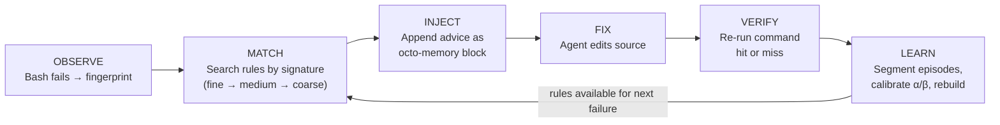
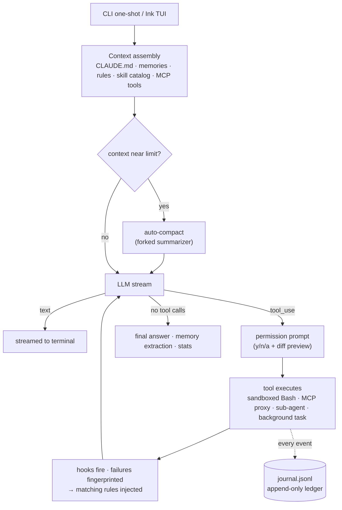

**English** | [简体中文](README.zh-CN.md)

# Octonoesis 🐙

[](https://github.com/PrestoOverture/octonoesis/actions/workflows/ci.yml)
[](LICENSE)

A self-calibrating terminal coding agent that gets better at *your* repo over time. It reads code, edits files with diff-previewed approvals, runs tests, connects to MCP servers, delegates to sub-agents, runs background tasks — and unlike agents that forget everything between sessions, it keeps an append-only observation ledger of every action and outcome, distills failure→fix episodes into human-readable rules, and injects those rules the next time the same class of error appears.

Built in TypeScript on **Bun**, with an **Ink** TUI. One design rule holds everywhere: **the LLM interprets, the harness authorizes.** Models may draft rules and summaries; only external evidence (a failing test turning green) and explicit user action may promote a rule, grant autonomy, or touch the ledger.


---

## Features

**Core agent**
- 7 built-in tools (Read, Glob, Grep, Edit, Write, Bash, TodoWrite) with Zod-validated inputs, serial execution, and repo-root path confinement.
- Interactive TUI and one-shot mode; streaming responses; clean `Ctrl+C` cancellation; 429/5xx retry with exponential backoff.
- Permission gate on every mutating action — `[y] once / [n] no / [a] always`, with colorized unified-diff previews for edits.
- Anthropic Claude by default; any OpenAI-compatible endpoint (GPT, DeepSeek, Qwen, Ollama) via `LLM_PROVIDER=openai` + `OPENAI_BASE_URL`.

**Context & memory**
- Auto-compaction: near the context limit, a forked summarizer compresses history and the session keeps going — 20+ turn sessions without overflow.
- Long-term memory: durable facts are auto-extracted at session end into `.octonoesis/memory/` (four types: user, feedback, project, reference) and recalled per query.
- Project instructions: `CLAUDE.md` is loaded into the system prompt; drop an `OCTONOESIS.md` beside it to take precedence, or set `projectInstructions: "off"`.
- Live observability: StatusBar shows model, tokens, cost, and context %; every session appends to `.octonoesis/stats.jsonl` and prints a cost summary on exit.

**Learning loop** — see [below](#learning-loop)

**Extensibility**
- Skills: drop a markdown file in `.octonoesis/skills/` and invoke it as `/my-skill` — inline (shapes the current conversation) or forked (isolated, read-only child).
- Hooks: shell commands on six lifecycle events (`pre_tool_use`, `post_tool_use`, `stop`, `session_start`, `session_end`, `compact`), configured in one file, time-budgeted so they can never stall the loop.
- One config file — `.octonoesis/config.json`: model, max turns, sandbox, MCP servers, hooks, permission allow/deny patterns. A trust gate keeps a *committed* config in a freshly cloned repo from running foreign hooks or servers until you opt in.
- macOS sandbox: opt-in `sandbox-exec` confinement for Bash — denies reads of `~/.ssh` & credential stores and writes to the observation ledger, while the permission prompt stays as the last line of defense.

**Integration**
- MCP: stdio servers from config, connected on first assembly (5s timeout, nonfatal), tools namespaced `mcp__{server}__{tool}` with the same permission treatment as built-ins.
- Sub-agents: delegate research to a read-only child agent (`Agent` tool) that shares your prompt cache; background agents run in isolated detached-HEAD git worktrees and accept mid-run `SendMessage` steering.
- Background tasks: run long commands with `run_in_background` — the conversation continues, a TaskChip ticks in the TUI, output streams to `.octonoesis/tasks/{id}.log`, and a `<task-notification>` reaches the model when the task finishes.


---

## Learning Loop

Every tool call is journaled with a three-level error fingerprint (`tool|error_class`, `+file`, `+expression`). A deterministic state machine segments the journal into fail→fix→verify **episodes**; an LLM distiller turns eligible episodes into **rules** — one markdown file each, readable, diffable, deletable; and on the next matching failure, the best rules (max 2) are **injected** alongside the tool output. A rule only earns confidence when the same command that failed comes back passing — Bayesian Beta posteriors, never model self-assessment.




A rule is just a file you can read, pin, ban, or delete:

```yaml
---
id: rule-optional-chaining-null
triggers:
  error_signatures:
    - Bash|TypeError|src/user.ts|evaluating 'user.name'
alpha: 5
beta: 2
confidence: 0.7143
evidence: [ep_0001, ep_0014]
status: active
---

When `bun test` fails with a TypeError on property access of a potentially null object,
add optional chaining (`?.`) and a nullish coalescing fallback (`?? defaultValue`).
Check the call site — the caller may be passing `null` where a valid object is expected.
```

```bash
ls .octonoesis/rules/               # every rule is a file
octonoesis rebuild-rules --force    # regenerate all rules from episodes.jsonl
octonoesis --stats                  # per-bucket Beta posterior + 95% credible interval
```

The active pool is capped at 150 rules — when full, rules compete on `specificity × confidence × time-decay`. Evidence (journal, episodes) grows without bound; beliefs stay bounded.

---

## Installation

- **Bun** ≥ 1.2.0 — `curl -fsSL https://bun.sh/install | bash`
- **ripgrep** (optional fallback if the bundled `@vscode/ripgrep` can't run): `brew install ripgrep` / `apt install ripgrep`

```bash
bun install -g octonoesis
```

## Quickstart

```bash
# Anthropic (default)
export ANTHROPIC_API_KEY="sk-..."

# ...or any OpenAI-compatible endpoint
export LLM_PROVIDER="openai"
export OPENAI_API_KEY="sk-..."
# export OPENAI_BASE_URL="https://api.deepseek.com"   # optional
```

```bash
octonoesis                                        # interactive TUI
octonoesis "Fix the failing test in src/user.ts"  # one-shot to stdout
octonoesis --sandbox "run the build"              # Bash confined by macOS sandbox
```

Optional per-repo configuration in `.octonoesis/config.json`:

```jsonc
{
  "model": "claude-sonnet-4-6",
  "maxTurns": 30,
  "sandbox": { "enabled": true },
  "mcpServers": {
    "fs": { "command": "bunx", "args": ["--bun", "@modelcontextprotocol/server-filesystem", "/data"] }
  },
  "hooks": [
    { "event": "post_tool_use", "toolPattern": "Bash", "command": "jq -r .outcome >> .hook-log" }
  ]
}
```

---

## API key handling

At startup, Octonoesis captures provider API keys in module memory and removes them from `process.env`. Tool subprocesses do not receive those keys by default; set `OCTONOESIS_INHERIT_API_KEYS=1` to opt Bash and background-shell children back into key inheritance. Provider fork children used for compaction, memory work, and sub-agents do receive the keys because they call the model provider.

Keys exported by your shell can still be visible to other same-user processes through OS process inspection. Prefer placing keys in the repository's `.env` file, which Bun loads without putting them in the exec-time environment. Every shell command remains permission-gated; that prompt is the operative security boundary.

---

## Architecture



Three layers, strictly ordered: the **journal** is the source of truth (append-only, never edited); **episodes, rules, and calibration** are derived views — rebuildable from the ledger at any time; the **context compiler** assembles a per-task packet under per-source token budgets, split into a cache-stable system prompt and a volatile preamble so prompt caching survives every turn.

---

## Research & Validation

The learning loop's claims are measured, not asserted — including the null and negative results. Highlights from the experimental record:

- 150-fixture validation across 15 error scenarios and 7 fingerprint buckets, plus 24 negative-control runs.
- **Cross-model rule transfer**: a rule distilled from a strong model's (Claude Haiku) resolved episode lifted a weak solver (gpt-4o-mini) from **2/20 to 20/20** on unseen instances of the same error class (exact McNemar p<0.001, pre-registered, negative control exactly null).
- **Self-loop**: the weak model teaching itself reached 11/20 from the same 2/20 floor — real, partial, and honestly bounded by distiller quality.
- A documented negative finding (RepoQuirk) and a methodology lesson (weak-model probes) are reported as such, not spun.

Full tables, pre-registrations, and transcripts: **[reports.md](reports.md)**.

---

## License

MIT — see [LICENSE](LICENSE).
