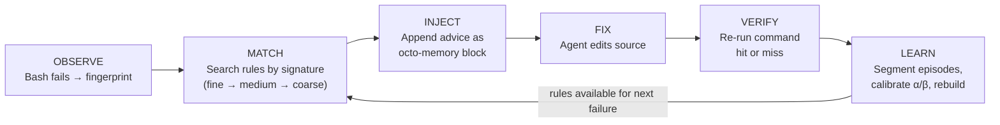
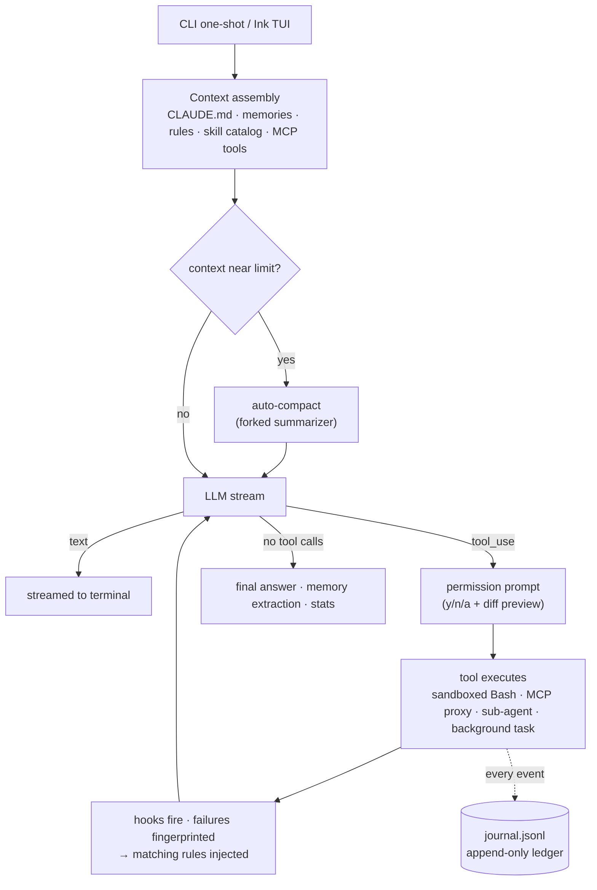

[English](README.md) | **简体中文**

# Octonoesis 🐙

[](https://github.com/PrestoOverture/octonoesis/actions/workflows/ci.yml)
[](LICENSE)

一个自我校准的终端编程智能体，会随着使用逐渐更懂*你的*代码仓库。它能阅读代码、以 diff 预览审批的方式编辑文件、运行测试、连接 MCP 服务器、委派子智能体、运行后台任务——而且与那些每次会话都"失忆"的智能体不同，它维护一份只追加的观察账本，记录每一次操作与结果，把"失败→修复"的过程蒸馏成人类可读的规则，并在下次遇到同类错误时把规则注入上下文。

基于 **Bun** 运行时、以 TypeScript 编写，使用 **Ink** 构建 TUI。一条设计原则贯穿始终：**LLM 负责解释，harness 负责授权。** 模型可以起草规则和摘要；但只有外部证据（一条失败的测试重新变绿）和用户的明确操作才能晋升规则、提升自治权限或触碰账本。


---

## 功能特性

**核心智能体**
- 7 个内置工具（Read、Glob、Grep、Edit、Write、Bash、TodoWrite），Zod 输入校验、串行执行、仓库根目录路径约束。
- 交互式 TUI 与一次性（one-shot）模式；流式输出；`Ctrl+C` 干净取消；429/5xx 指数退避重试。
- 每个有副作用的操作都要经过权限门——`[y] 本次允许 / [n] 拒绝 / [a] 总是允许`，编辑操作附带彩色 unified diff 预览。
- 默认 Anthropic Claude；通过 `LLM_PROVIDER=openai` + `OPENAI_BASE_URL` 支持任何 OpenAI 兼容端点（GPT、DeepSeek、Qwen、Ollama）。

**上下文与记忆**
- 自动压缩：接近上下文上限时，由 fork 出的摘要器压缩历史，会话继续——20+ 轮会话不会溢出。
- 长期记忆：会话结束时自动提取持久事实到 `.octonoesis/memory/`（四类：user、feedback、project、reference），并按查询召回。
- 项目指令：`CLAUDE.md` 会被载入系统提示词；放一个 `OCTONOESIS.md` 可覆盖它，也可设置 `projectInstructions: "off"` 关闭。
- 实时可观测性：状态栏显示模型、token、费用与上下文占用百分比；每次会话追加写入 `.octonoesis/stats.jsonl`，退出时打印费用摘要。

**学习闭环** —— 见[下文](#学习闭环)

**可扩展性**
- 技能（Skills）：往 `.octonoesis/skills/` 放一个 markdown 文件，即可用 `/my-skill` 调用——inline 模式（塑造当前对话）或 fork 模式（隔离的只读子进程）。
- 钩子（Hooks）：在六个生命周期事件（`pre_tool_use`、`post_tool_use`、`stop`、`session_start`、`session_end`、`compact`）上运行 shell 命令，统一由配置文件管理，且有时间预算，永远不会卡住主循环。
- 一个配置文件——`.octonoesis/config.json`：模型、最大轮数、沙箱、MCP 服务器、钩子、权限允许/拒绝模式。信任门控确保克隆下来的仓库里*被提交的*配置不会在你确认之前执行陌生的钩子或服务器。
- macOS 沙箱：可选的 `sandbox-exec` Bash 隔离——拒绝读取 `~/.ssh` 与凭据存储、拒绝写入观察账本，同时权限确认仍是最后一道防线。

**集成能力**
- MCP：从配置启动 stdio 服务器，首次组装时连接（5 秒超时、失败不致命），工具以 `mcp__{server}__{tool}` 命名，与内置工具享受同等权限管控。
- 子智能体：用 `Agent` 工具把调研工作委派给只读子智能体（共享提示词缓存）；后台智能体运行在隔离的 detached-HEAD git worktree 中，并可通过 `SendMessage` 中途追加指令。
- 后台任务：用 `run_in_background` 运行耗时命令——对话不被阻塞，TUI 中 TaskChip 实时计时，输出流式写入 `.octonoesis/tasks/{id}.log`，任务结束时模型收到 `<task-notification>` 通知。


---

## 学习闭环

每次工具调用都会连同三级错误指纹（`tool|error_class`、`+file`、`+expression`）写入账本。一个确定性状态机把账本切分为"失败→修复→验证"的**片段（episode）**；LLM 蒸馏器把合格片段转化为**规则**——每条规则一个 markdown 文件，可读、可 diff、可删除；下次遇到匹配的失败时，最优规则（最多 2 条）随工具输出一起被**注入**。规则只有在"当初失败的那条命令重新通过"时才能积累置信度——贝叶斯 Beta 后验，绝不采用模型自评。




规则就是一个你可以阅读、置顶、禁用或删除的文件：

```yaml
---
id: rule-optional-chaining-null
triggers:
  error_signatures:
    - Bash|TypeError|src/user.ts|evaluating 'user.name'
alpha: 5
beta: 2
confidence: 0.7143
evidence: [ep_0001, ep_0014]
status: active
---

When `bun test` fails with a TypeError on property access of a potentially null object,
add optional chaining (`?.`) and a nullish coalescing fallback (`?? defaultValue`).
Check the call site — the caller may be passing `null` where a valid object is expected.
```

```bash
ls .octonoesis/rules/               # 每条规则一个文件
octonoesis rebuild-rules --force    # 从 episodes.jsonl 重建全部规则
octonoesis --stats                  # 每个 bucket 的 Beta 后验 + 95% 可信区间
```

活跃规则池上限 150 条——池满时按 `specificity × confidence × time-decay` 竞争淘汰。证据（账本、片段）无限增长；活跃信念始终有界。

---

## 安装

- **Bun** ≥ 1.2.0 —— `curl -fsSL https://bun.sh/install | bash`
- **ripgrep**（可选兜底，当自带的 `@vscode/ripgrep` 无法运行时）：`brew install ripgrep` / `apt install ripgrep`

```bash
bun install -g octonoesis
```

也可以用 npm 或 npx —— 本包已发布到 npm registry：

```bash
npm install -g octonoesis
npx octonoesis "修复 src/user.ts 里失败的测试"
```

**Bun 是运行时依赖，不只是构建工具。** 发布的产物是 Bun bundle（`#!/usr/bin/env bun`），在 Node 下无法运行——即使通过 npm 安装，`PATH` 里仍然需要有 `bun`。如果不想安装 Bun，可以从 [Releases](https://github.com/PrestoOverture/octonoesis/releases) 下载独立二进制（`octonoesis-linux-x64`、`octonoesis-macos-arm64`），它们已把 Bun 编译进去，没有任何运行时依赖。

## 快速开始

```bash
# Anthropic（默认）
export ANTHROPIC_API_KEY="sk-..."

# ……或任何 OpenAI 兼容端点
export LLM_PROVIDER="openai"
export OPENAI_API_KEY="sk-..."
# export OPENAI_BASE_URL="https://api.deepseek.com"   # 可选
```

```bash
octonoesis                                        # 交互式 TUI
octonoesis "Fix the failing test in src/user.ts"  # 一次性模式，输出到 stdout
octonoesis --sandbox "run the build"              # Bash 在 macOS 沙箱内运行
```

可选的仓库级配置 `.octonoesis/config.json`：

```jsonc
{
  "model": "claude-sonnet-4-6",
  "maxTurns": 30,
  "sandbox": { "enabled": true },
  "mcpServers": {
    "fs": { "command": "bunx", "args": ["--bun", "@modelcontextprotocol/server-filesystem", "/data"] }
  },
  "hooks": [
    { "event": "post_tool_use", "toolPattern": "Bash", "command": "jq -r .outcome >> .hook-log" }
  ]
}
```

---

## API 密钥处理

Octonoesis 启动时会将模型提供商的 API 密钥捕获到模块内存，并从 `process.env` 中删除。默认不会把这些密钥传给工具子进程；设置 `OCTONOESIS_INHERIT_API_KEYS=1` 后，Bash 与后台 shell 子进程才会重新继承密钥。用于上下文压缩、记忆处理和子代理的提供商 fork 子进程会收到密钥，因为它们需要调用模型提供商。

如果密钥由 shell `export`，同一用户的其他进程仍可能通过操作系统进程检查看到它们。建议将密钥放在仓库的 `.env` 文件中；Bun 会直接加载该文件，密钥不会进入 exec 时的环境。所有 shell 命令仍需经过权限确认；该提示才是实际生效的安全边界。

---

## 架构



三层结构，严格分层：**账本（journal）**是唯一事实来源（只追加、永不修改）；**片段、规则与校准数据**是派生视图——随时可从账本重建；**上下文编译器**在各来源 token 预算内组装任务上下文包，并拆分为缓存稳定的系统提示词与易变前导，让提示词缓存在每一轮都有效。

---

## 研究与验证

学习闭环的每一项主张都经过测量而非断言——包括无效与阴性结果。实验记录要点：

- 150 个 fixture、15 类错误场景、7 个指纹 bucket 的验证，外加 24 次阴性对照。
- **跨模型规则迁移**：由强模型（Claude Haiku）已解决片段蒸馏出的规则，把弱求解器（gpt-4o-mini）在同类未见实例上的成绩从 **2/20 拉到 20/20**（精确 McNemar p<0.001，预注册终点，阴性对照恰好为零效应）。
- **自我闭环**：弱模型教自己，从同样的 2/20 提升到 11/20——效应真实但有限，坦率地受蒸馏器质量约束。
- 一项阴性发现（RepoQuirk）与一课方法论教训（弱模型探针）如实报告，不加粉饰。

完整表格、预注册与实验记录：**[reports.md](reports.md)**（英文）。

---

## 许可证

MIT —— 见 [LICENSE](LICENSE)。
