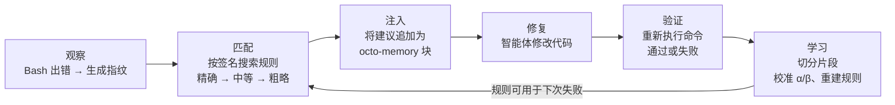
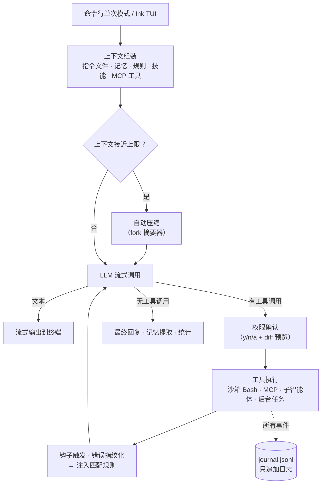

[English](README.md) | **简体中文**

# Octonoesis 🐙

[](https://github.com/PrestoOverture/octonoesis/actions/workflows/ci.yml)
[](LICENSE)

一个会从自己的错误中学习的终端编程智能体。

读代码、改文件、跑测试、连接 MCP、委派子智能体、运行后台任务——这些 Octonoesis 都能做，但不一样的是：它会随着使用逐渐更懂*你的*代码仓库。与那些每次会话都"失忆"的智能体不同，它维护一份只追加的（append-only）观察账本，记录每一次操作与结果，把"失败→修复"的过程蒸馏成人类可读的规则，并在下次遇到同类错误时把规则注入上下文。

基于 **Bun** 运行时、以 TypeScript 编写，使用 **Ink** 构建 TUI。一条设计原则贯穿始终：**LLM 负责解释，harness 负责授权。** 模型可以起草规则和摘要，但只有外部证据（一条失败的测试重新变绿）和用户的明确操作才能晋升规则、提升自治权限或触碰账本。学习到的经验只靠规则决定去留，不靠模型自评。


---

## 功能

**核心**
- 7 个内置工具（Read、Glob、Grep、Edit、Write、Bash、TodoWrite），Zod 校验，串行执行，路径锁定在仓库根目录内。
- 交互式 TUI + 一次性命令行模式，流式输出，`Ctrl+C` 取消，429/5xx 指数退避重试。
- 每个非只读的（Non-Read Only）操作都要经过用户授权：`[y] 允许 / [n] 拒绝 / [a] 总是允许`，编辑带 diff 预览。
- 默认 Claude，也支持任何 OpenAI 兼容端点（GPT、DeepSeek、Qwen、Ollama）。

**上下文与记忆**
- 上下文快满时自动压缩（fork 出摘要器）。
- 长期记忆：会话结束时自动提取持久事实（分别为：user、feedback、project、reference）到 `.octonoesis/memory/`，下次查询时召回。
- 项目指令：`CLAUDE.md` 会被载入系统提示词；放一个 `OCTONOESIS.md` 可覆盖它，也可设置 `projectInstructions: "off"` 关闭。
- 实时可观测性：状态栏显示模型、token、费用与上下文占用百分比；每次会话追加写入 `.octonoesis/stats.jsonl`，退出时 print 总花费。

**学习闭环** —— 见[下文](#学习闭环)

**可扩展**
- **技能（Skills）**：往 `.octonoesis/skills/` 放 markdown 文件，用 `/my-skill` 调用。
- **钩子（Hooks）**：6 个生命周期事件（`pre_tool_use`、`post_tool_use`、`stop`、`session_start`、`session_end`、`compact`）上挂 shell 命令，有时间预算，不会卡主循环。
- **配置（Configurations）**：一个文件搞定（`.octonoesis/config.json`）——模型、MCP 服务器、钩子、权限、沙箱。克隆下来的仓库里的配置不会自动执行，得手动允许。
- **macOS 沙箱（Sandbox）**：可选的 `sandbox-exec` 隔离 Bash，阻止读取 `~/.ssh` 和凭据存储。

**集成**
- **MCP**：配置 stdio 服务器，工具名自动加 `mcp__{server}__{tool}` 前缀，权限管控和内置工具一致。
- **子智能体（Sub-agents）**：`Agent` 工具委派只读子智能体，共享 prompt cache。后台智能体跑在独立 worktree 里，支持 `SendMessage` 中途追加指令。
- **后台任务（Background Tasks）**：`run_in_background` 让命令在后台跑，不阻塞对话。TUI 里有 TaskChip 计时，输出写到 `.octonoesis/tasks/{id}.log`，跑完自动通知模型。


---

## 学习闭环

每次工具调用连同三级错误指纹（`tool|error_class`、`+file`、`+expression`）写入**日志（journal）**。状态机把日志切分成"失败→修复→验证"的**片段（episode）**；LLM 蒸馏器把合格片段转成**规则（rules）**——每条一个 markdown 文件。下次碰到匹配的失败，最相关的规则（最多 2 条）和工具输出一起**注入**上下文。

规则的置信度只有一种积累方式：当初失败的命令重新跑过。贝叶斯 Beta 后验，不靠模型自评。




规则就是一个文件，可以看、可以改、可以删：

```yaml
---
id: rule-optional-chaining-null
triggers:
  error_signatures:
    - Bash|TypeError|src/user.ts|evaluating 'user.name'
alpha: 5
beta: 2
confidence: 0.7143
evidence: [ep_0001, ep_0014]
status: active
---

When `bun test` fails with a TypeError on property access of a potentially null object,
add optional chaining (`?.`) and a nullish coalescing fallback (`?? defaultValue`).
Check the call site — the caller may be passing `null` where a valid object is expected.
```

```bash
ls .octonoesis/rules/               # 每条规则一个文件
octonoesis rebuild-rules --force    # 从 episodes.jsonl 重建全部规则
octonoesis --stats                  # 每个 bucket 的 Beta 后验 + 95% 置信区间
```

活跃规则池上限 150 条。满了之后按 `specificity × confidence × time-decay` 竞争淘汰。账本可以无限增长，但是活跃的规则有限。

---

## 安装

**前置条件：**
- **Bun** ≥ 1.2.0 —— `curl -fsSL https://bun.sh/install | bash`
- **ripgrep**（可选，当自带的 `@vscode/ripgrep` 跑不起来时兜底）

```bash
bun install -g octonoesis
```

npm / npx 也行：

```bash
npm install -g octonoesis
npx octonoesis "修复 src/user.ts 里失败的测试"
```

**Bun 是运行时依赖，不只是构建工具。** 发布产物是 Bun bundle（`#!/usr/bin/env bun`），Node 跑不了——即使用 npm 装，`PATH` 里也得有 `bun`。不想装 Bun 的话，直接从 [Releases](https://github.com/PrestoOverture/octonoesis/releases) 下载独立二进制，Bun 已经编译进去了，零依赖。

## 快速开始

```bash
# Anthropic（默认）
export ANTHROPIC_API_KEY="sk-..."

# ……或任何 OpenAI 兼容端点
export LLM_PROVIDER="openai"
export OPENAI_API_KEY="sk-..."
# export OPENAI_BASE_URL="https://api.deepseek.com"
```

```bash
octonoesis                                        # 交互式 TUI
octonoesis "修复 src/user.ts 里失败的测试"         # 一次性模式
octonoesis --sandbox "run the build"              # Bash 跑在 macOS 沙箱里
```

仓库级配置（`.octonoesis/config.json`）：

```jsonc
{
  "model": "claude-sonnet-4-6",
  "maxTurns": 30,
  "sandbox": { "enabled": true },
  "mcpServers": {
    "fs": { "command": "bunx", "args": ["--bun", "@modelcontextprotocol/server-filesystem", "/data"] }
  },
  "hooks": [
    { "event": "post_tool_use", "toolPattern": "Bash", "command": "jq -r .outcome >> .hook-log" }
  ]
}
```

---

## API 密钥

启动时，Octonoesis 把 API 密钥存到模块内存，从 `process.env` 里清掉。工具子进程默认拿不到密钥，设 `OCTONOESIS_INHERIT_API_KEYS=1` 可以放开。压缩、记忆、子智能体用的 fork 子进程会拿到密钥，因为它们要调模型。

shell `export` 的密钥仍然可能被同用户的其他进程通过 OS 检查看到。建议把密钥放在仓库 `.env` 里，Bun 直接加载，不进环境变量。每条 shell 命令都要过权限确认——那才是真正的安全边界。

---

## 架构



三层结构：**日志（journal）** 是唯一事实来源，只追加，不修改。**片段、规则、校准数据**是派生视图，随时可从日志重建。**上下文编译器**在 token 预算内组装每次任务的上下文包，拆成缓存稳定的系统提示词和易变前导，让 prompt cache 每轮都生效。

---

## 研究与验证

学习闭环的所有结论均经过实测验证，并如实记录了未生效及阴性结果：

- **基准验证**：包含 150 个 Fixture 验证，覆盖 15 类错误场景、7 个指纹 Bucket，并配置了 24 次阴性对照。
- **跨模型规则迁移**：使用强模型（Claude Haiku）蒸馏出的规则，成功帮助弱模型（gpt-4o-mini）在同类未见实例上的修复成功率从 **2/20 提升至 20/20**（McNemar 检验 p < 0.001，预注册实验，阴性对照显示零效应）。
- **自我闭环**：弱模型使用自身蒸馏的规则，修复成功率从 **2/20 提升至 11/20**——证明自我迭代有效，但上限受限于蒸馏器自身的模型能力。
- **阴性发现与反思**：如实报告了 1 项未生效场景（RepoQuirk）与 1 次探针设计上的经验教训（弱模型探针实验）。

完整数据：**[reports.md](reports.md)**（英文）。

---

## 许可

MIT —— 见 [LICENSE](LICENSE)。
