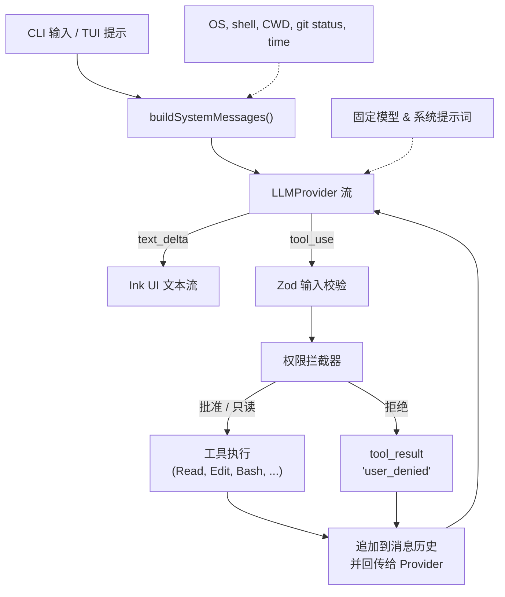
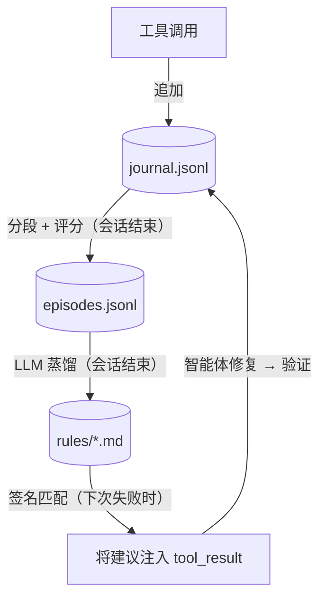
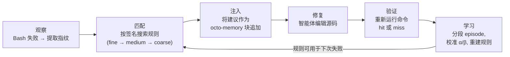

[English](README.md) | **简体中文**

# Octonoesis 🐙

一个开源、轻量、极速的终端编程智能体，能够阅读代码、搜索目录、通过 unified diff 审批编辑文件、运行测试，并自动执行命令来完成自然语言任务。

完全基于 **Bun** 运行时用 TypeScript 构建，使用 **Ink** 提供丰富、响应式的终端用户界面（TUI）。

---

## 架构流程



---

## 功能特性

- **标准化工具系统**：串行执行工具，通过 Zod 严格校验参数，沙箱安全边界确保路径不超出仓库根目录。
- **交互式权限 UI**：对修改操作（如 `Edit` 或 `Bash`）弹出 `[y] 是 / [n] 否 / [a] 始终允许` 确认，附带彩色 unified diff 预览。
- **健壮的取消与重试**：`Ctrl+C` 可干净地中断运行中的进程和模型流。速率限制（429）和服务端错误（5xx）通过指数退避加抖动自动重试。
- **Provider 抽象**：一等支持 Anthropic Claude、OpenAI GPT-4o 和 DeepSeek，端点配置简便。
- **动态上下文后缀**：实时计算运行环境状态（OS、Shell、Git porcelain status、时间、Token 用量）为 LLM 提供动态上下文。

---

## 安装

### 前置依赖
- **Bun**（版本 `>= 1.2.0`）。安装 Bun：
  ```bash
  curl -fsSL https://bun.sh/install | bash
  ```
- **ripgrep**（可选；当系统策略阻止预编译 `@vscode/ripgrep` 时建议安装）：
  ```bash
  # macOS
  brew install ripgrep
  # Debian/Ubuntu
  sudo apt-get install ripgrep
  ```

### 全局安装
```bash
bun install -g octonoesis
```

---

## 快速上手（5 分钟）

1. 在环境变量中设置 API Key：
   ```bash
   # Anthropic（默认）
   export ANTHROPIC_API_KEY="your-api-key"

   # OpenAI
   export LLM_PROVIDER="openai"
   export OPENAI_API_KEY="your-api-key"
   ```

2. 以两种模式之一运行：
   - **交互式 TUI 模式**：
     ```bash
     octonoesis
     ```
     启动完整终端面板，左侧显示 LLM 对话流，右侧显示实时内存 TODO 状态面板。
   
   - **单次模式**：
     ```bash
     octonoesis "修复 src/utils/errors.ts 的拼写错误"
     ```
     将解决方案直接流式输出到标准输出后退出。

---

## 学习循环

Octonoesis 内置学习循环，能够观察智能体如何解决错误并从中蒸馏出可复用的规则。与自我评估方法不同，每条规则都基于**外部验证的结果** — 只有当之前失败的 `bun test`（或等效命令）重新通过时，规则才会获得信用。

### 架构



三个持久化层构成闭环：

- **Journal（日志）**：每次工具调用都会附带其指纹追加写入（三级签名：`tool|error_class`、`tool|error_class|file`、`tool|error_class|file|expression`）。日志写入后不可修改。
- **Episodes（事件）**：分段状态机将日志事件分组为 fail→fix→verify 循环。每个 episode 会被评分：`abandoned`、`unattributable` 和 `transient` 的 episode 被排除；`resolved` 的 episode 根据归因置信度获得价值分数。
- **Rules（规则）**：蒸馏器（使用最便宜的可用模型）读取每个合格 episode 并输出规则文件 — 一个包含 YAML frontmatter（触发签名、Beta 分布置信度先验）和修复建议的 markdown 文档。

### 注入循环



智能体对学习机制完全无感 — 它只是在正常工具输出旁边收到上下文建议。

### 规则文件示例

```yaml
---
id: rule-optional-chaining-null
triggers:
  tools:
    - Bash
  command_prefix:
    - bun test
  error_signatures:
    - Bash|TypeError|src/user.ts|evaluating 'user.name'
scope: repo
alpha: 5
beta: 2
confidence: 0.7143
evidence:
  - ep_0001
  - ep_0014
hits: 3
misses: 0
anchor:
  file: src/user.ts
status: active
---

当 `bun test` 因为访问可能为 null 的对象属性而报 TypeError 时，
添加可选链（`?.`）和空值合并回退（`?? defaultValue`）。
检查调用方 — 可能在函数期望有效对象的地方传入了 `null`。
```

### 规则管理

```bash
# 列出所有规则
ls .octonoesis/rules/

# 查看规则
cat .octonoesis/rules/rule-optional-chaining-null.md

# 删除规则（除非对应 episode 仍存在，否则下次 rebuild 不会重新生成）
rm .octonoesis/rules/rule-optional-chaining-null.md

# 从 episodes 强制完整重建
octonoesis rebuild-rules --force

# 查看校准统计
octonoesis --stats
```

`--stats` 输出示例：

```
Bucket                          | Observations | Posterior Mean | 95% Credible Interval | Recommendation
--------------------------------+--------------+----------------+-----------------------+-----------------
Bash|TypeError                  | 24           | 72%            | [58% - 84%]           | confident
Bash|SyntaxError                | 18           | 65%            | [48% - 80%]           | confident
Bash|ReferenceError             | 15           | 68%            | [49% - 84%]           | confident
Bash|ImportError                | 12           | 61%            | [40% - 80%]           | uncertain
Bash|AssertionError             | 20           | 58%            | [42% - 73%]           | ⚠ review recommended
```

### 规则池与生命周期

规则池上限为 **150 条 active + candidate** 规则。超出上限时，按 `specificity × confidence × timeDecay` 评分，最低分的规则被退休（文件保留在磁盘但不再参与匹配）。生命周期转换：candidate → active（置信度 ≥ 0.55，CI 下界 > 0.3），active → retired（CI 上界 < 0.45 或锚定文件被删除），pinned/banned 状态不受影响。

### 验证

Phase 19 从六个维度验证了学习循环：

| 测试集 | 覆盖内容 | 规模 |
|--------|---------|------|
| Fixture 语料库 | 15 种错误场景，覆盖 7 个 coarse 桶 | 150 个 fixture |
| 跨模式泛化 | 从一个实例蒸馏的规则能修复同类型的其他实例 | ~75 个会话，含 5 个负迁移检查 |
| 证据链完整性 | 所有规则的 Rule→Episode→Journal 溯源完整 | 5 个代表性全流水线运行 |
| 负面控制 | 8 种失败模式：无错误、无指纹、miss、权限拒绝、abandoned、transient、banned、去重 | 24 次运行（8 × 3 种随机类型） |
| 校准累积 | Beta 后验在观测增加时收敛 | 15 个桶共 196 条校准记录 |
| 重建 + 规模基准 | 500 episode 重建、池上限执行、匹配预算、状态保持、幂等性、真实进程冒烟测试 | 199 个断言 |

真实进程冒烟测试（子测试 7）对 3 个物化 fixture 运行实际的 `bun test`，确认 fail→fix→pass 循环在真实工具输出下工作，而非仅依赖 mock 数据。

### 已知局限

1. **简单 bug 的天花板效应**：Haiku 级模型在 3/5 基准 bug 类型上以 100% 成功率一轮解决，规则注入没有提升空间。学习循环的价值最适合中等难度的 bug — 足够难以至于模型有时会失败，但足够通用以至于一个实例学到的建议能迁移到另一个实例。
2. **实例级修复难以泛化**：ModuleNotFound 规则学到的是具体的导入路径修复（如 `./config-loader` → `./config`），无法迁移到导入路径不同的其他实例。规则需要捕获*策略*（"检查目录中存在哪些模块"），而非具体的编辑操作。

### 实时 A/B 基准测试

`test/demo/live-ab.ts` 衡量规则注入是否改变了真实 LLM 的修复行为。它使用最便宜的可用模型，针对物化 fixture 运行配对的控制组（无规则）与实验组（有蒸馏规则）会话。

```bash
# 快速冒烟测试（2 轮，1 种类型）
bun run test/demo/live-ab.ts --runs 2 --types NullAccess

# 完整基准测试（10 轮 × 5 种类型 = 50 对）
bun run test/demo/live-ab.ts --runs 10
```

#### 结果（Claude Haiku 4.5，50 对）

```
=== 总体（5 种类型 x 10 轮 = 50 对）===
| 指标            | 控制组         | 实验组         | 差异           | p 值     |
|-----------------|---------------|---------------|--------------|----------|
| 轮次            | 1.5 ± 1.3     | 1.4 ± 1.1     | +3% ± 60%     | 0.296    |
| Token（输入）   | 715 ± 619     | 805 ± 496     | +39% ± 94%    | 0.234    |
| Token（输出）   | 213 ± 292     | 200 ± 193     | +25% ± 93%    | 0.524    |
| 成功率          | 45/50         | 44/50         | —             | —        |
```

**无统计显著改善。** 按类型分解：

| 类型 | 控制组 | 实验组 | 信号 |
|------|--------|--------|------|
| NullAccess | 10/10, 1.0 轮 | 10/10, 1.0 轮 | 天花板 — 太简单 |
| ParseError | 10/10, 1.0 轮 | 10/10, 1.0 轮 | 天花板 — 太简单 |
| UndefinedRef | 10/10, 1.0 轮 | 10/10, 1.0 轮 | 天花板 — 太简单 |
| ExpectMismatch | 7/10, 2.8 轮 | 7/10, 1.8 轮 | 混合 — 规则在 C1/C2/B3 上有帮助，在 D1/E1 上有害 |
| ModuleNotFound | 8/10, 1.8 轮 | 7/10, 2.1 轮 | 负面 — 规则太针对具体实例 |

ExpectMismatch 显示了最明确的正向信号：个别运行从 4 轮降至 1 轮，2 个失败变为成功。但其他运行中的负迁移抵消了收益。学习循环的机制已验证 — 问题在于 fixture 的难度和规则的泛化能力。

---

## 许可证

本项目采用 MIT 许可证。详见 [LICENSE](LICENSE)。
