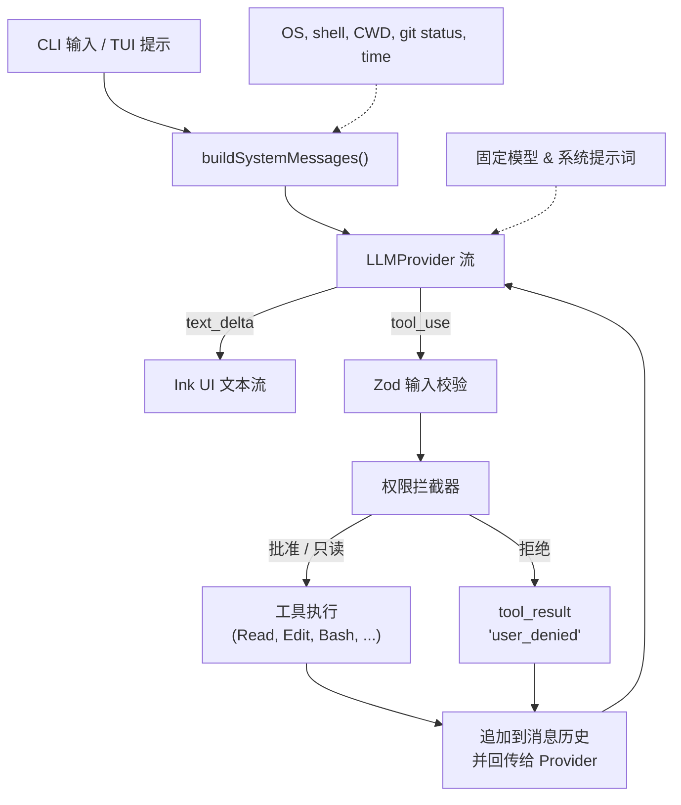
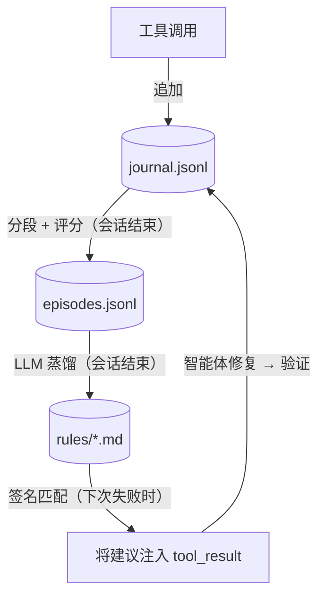
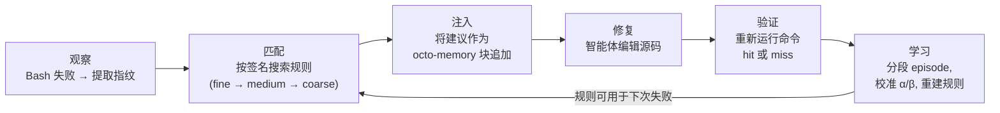

[English](README.md) | **简体中文**

# Octonoesis 🐙

一个开源、轻量、极速的终端编程智能体，能够阅读代码、搜索目录、通过 unified diff 审批编辑文件、运行测试，并自动执行命令来完成自然语言任务。

完全基于 **Bun** 运行时用 TypeScript 构建，使用 **Ink** 提供丰富、响应式的终端用户界面（TUI）。

---

## 架构流程



---

## 功能特性

- **标准化工具系统**：串行执行工具，通过 Zod 严格校验参数，沙箱安全边界确保路径不超出仓库根目录。
- **交互式权限 UI**：对修改操作（如 `Edit` 或 `Bash`）弹出 `[y] 是 / [n] 否 / [a] 始终允许` 确认，附带彩色 unified diff 预览。
- **健壮的取消与重试**：`Ctrl+C` 可干净地中断运行中的进程和模型流。速率限制（429）和服务端错误（5xx）通过指数退避加抖动自动重试。
- **Provider 抽象**：一等支持 Anthropic Claude、OpenAI GPT-4o 和 DeepSeek，端点配置简便。
- **动态上下文后缀**：实时计算运行环境状态（OS、Shell、Git porcelain status、时间、Token 用量）为 LLM 提供动态上下文。

---

## 安装

### 前置依赖
- **Bun**（版本 `>= 1.2.0`）。安装 Bun：
  ```bash
  curl -fsSL https://bun.sh/install | bash
  ```
- **ripgrep**（可选；当系统策略阻止预编译 `@vscode/ripgrep` 时建议安装）：
  ```bash
  # macOS
  brew install ripgrep
  # Debian/Ubuntu
  sudo apt-get install ripgrep
  ```

### 全局安装
```bash
bun install -g octonoesis
```

---

## 快速上手（5 分钟）

1. 在环境变量中设置 API Key：
   ```bash
   # Anthropic（默认）
   export ANTHROPIC_API_KEY="your-api-key"

   # OpenAI
   export LLM_PROVIDER="openai"
   export OPENAI_API_KEY="your-api-key"
   ```

2. 以两种模式之一运行：
   - **交互式 TUI 模式**：
     ```bash
     octonoesis
     ```
     启动完整终端面板，左侧显示 LLM 对话流，右侧显示实时内存 TODO 状态面板。
   
   - **单次模式**：
     ```bash
     octonoesis "修复 src/utils/errors.ts 的拼写错误"
     ```
     将解决方案直接流式输出到标准输出后退出。

---

## 学习循环

Octonoesis 内置学习循环，能够观察智能体如何解决错误并从中蒸馏出可复用的规则。与自我评估方法不同，每条规则都基于**外部验证的结果** — 只有当之前失败的 `bun test`（或等效命令）重新通过时，规则才会获得信用。

### 架构



三个持久化层构成闭环：

- **Journal（日志）**：每次工具调用都会附带其指纹追加写入（三级签名：`tool|error_class`、`tool|error_class|file`、`tool|error_class|file|expression`）。日志写入后不可修改。
- **Episodes（事件）**：分段状态机将日志事件分组为 fail→fix→verify 循环。每个 episode 会被评分：`abandoned`、`unattributable` 和 `transient` 的 episode 被排除；`resolved` 的 episode 根据归因置信度获得价值分数。
- **Rules（规则）**：蒸馏器（使用最便宜的可用模型）读取每个合格 episode 并输出规则文件 — 一个包含 YAML frontmatter（触发签名、Beta 分布置信度先验）和修复建议的 markdown 文档。

### 注入循环



智能体对学习机制完全无感 — 它只是在正常工具输出旁边收到上下文建议。

### 规则文件示例

```yaml
---
id: rule-optional-chaining-null
triggers:
  tools:
    - Bash
  command_prefix:
    - bun test
  error_signatures:
    - Bash|TypeError|src/user.ts|evaluating 'user.name'
scope: repo
alpha: 5
beta: 2
confidence: 0.7143
evidence:
  - ep_0001
  - ep_0014
hits: 3
misses: 0
anchor:
  file: src/user.ts
status: active
---

当 `bun test` 因为访问可能为 null 的对象属性而报 TypeError 时，
添加可选链（`?.`）和空值合并回退（`?? defaultValue`）。
检查调用方 — 可能在函数期望有效对象的地方传入了 `null`。
```

### 规则管理

```bash
# 列出所有规则
ls .octonoesis/rules/

# 查看规则
cat .octonoesis/rules/rule-optional-chaining-null.md

# 删除规则（除非对应 episode 仍存在，否则下次 rebuild 不会重新生成）
rm .octonoesis/rules/rule-optional-chaining-null.md

# 从 episodes 强制完整重建
octonoesis rebuild-rules --force

# 查看校准统计
octonoesis --stats
```

`--stats` 输出示例：

```
Bucket                          | Observations | Posterior Mean | 95% Credible Interval | Recommendation
--------------------------------+--------------+----------------+-----------------------+-----------------
Bash|TypeError                  | 24           | 72%            | [58% - 84%]           | confident
Bash|SyntaxError                | 18           | 65%            | [48% - 80%]           | confident
Bash|ReferenceError             | 15           | 68%            | [49% - 84%]           | confident
Bash|ImportError                | 12           | 61%            | [40% - 80%]           | uncertain
Bash|AssertionError             | 20           | 58%            | [42% - 73%]           | ⚠ review recommended
```

### 规则池与生命周期

规则池上限为 **150 条 active + candidate** 规则。超出上限时，按 `specificity × confidence × timeDecay` 评分，最低分的规则被退休（文件保留在磁盘但不再参与匹配）。生命周期转换：candidate → active（置信度 ≥ 0.55，CI 下界 > 0.3），active → retired（CI 上界 < 0.45 或锚定文件被删除），pinned/banned 状态不受影响。

### 验证

Phase 19 从六个维度验证了学习循环：

| 测试集 | 覆盖内容 | 规模 |
|--------|---------|------|
| Fixture 语料库 | 15 种错误场景，覆盖 7 个 coarse 桶 | 150 个 fixture |
| 跨模式泛化 | 从一个实例蒸馏的规则能修复同类型的其他实例 | ~75 个会话，含 5 个负迁移检查 |
| 证据链完整性 | 所有规则的 Rule→Episode→Journal 溯源完整 | 5 个代表性全流水线运行 |
| 负面控制 | 8 种失败模式：无错误、无指纹、miss、权限拒绝、abandoned、transient、banned、去重 | 24 次运行（8 × 3 种随机类型） |
| 校准累积 | Beta 后验在观测增加时收敛 | 15 个桶共 196 条校准记录 |
| 重建 + 规模基准 | 500 episode 重建、池上限执行、匹配预算、状态保持、幂等性、真实进程冒烟测试 | 199 个断言 |

真实进程冒烟测试（子测试 7）对 3 个物化 fixture 运行实际的 `bun test`，确认 fail→fix→pass 循环在真实工具输出下工作，而非仅依赖 mock 数据。

### 已知局限

1. **简单 bug 的天花板效应**：Haiku 级模型在 3/5 基准 bug 类型上以 100% 成功率一轮解决，规则注入没有提升空间。学习循环的价值最适合中等难度的 bug — 足够难以至于模型有时会失败，但足够通用以至于一个实例学到的建议能迁移到另一个实例。
2. **实例级修复 vs. 仓库层面事实**：蒸馏器（`src/memory/rules/distill.ts`）现在会拿到真实的错误输出和真实的修复 diff，其 prompt 要求建议在同一错误类别的*不同实例*之间泛化（例如"检查目录中存在哪些模块"，而非"把 `./config-loader` 改成 `./config`"），但当证据揭示出*仓库结构性事实*时（一个 import 别名、一个 barrel 导出约定、一个配置 schema 字段），仍应把它直接陈述为事实 — 这些事实在同一仓库里对每一次后续发生都成立，把它们藏在"去读文件确认"背后就违背了写下这条规则的意义。这修复了 ModuleNotFound 的负迁移问题（见下文）。仍然悬而未决的是：即便仓库层面的事实被直接陈述，注入的建议也不能可靠地让 solver 跳过重新验证式的读取 — 见下文的 RepoQuirk 发现。重复门槛（要求 ≥2 个共享同一 signature 的 episode 才蒸馏规则）和真实仓库的纵向验证都推迟到 v1.0；本基准测试使用的是单 episode 播种，是不同的场景。

### 实时 A/B 基准测试

`test/demo/live-ab.ts` 衡量规则注入是否改变了真实 LLM 的修复行为。它针对物化 fixture 运行配对的控制组（无规则）与实验组（有蒸馏规则）会话。

```bash
# 快速冒烟测试（2 轮，1 种类型）
bun run test/demo/live-ab.ts --runs 2 --types NullAccess

# 完整基准测试（10 轮 × 5 种类型 = 50 对）
bun run test/demo/live-ab.ts --runs 10

# 弱模型探测（任意 OpenAI 兼容模型）— 需显式指定 --distill-model。
# 若省略，蒸馏器会默默回退到该 provider 最便宜的模型（gpt-5-nano —
# 一个推理模型，会把蒸馏器 1000 token 的上限都耗在推理上，导致自身的
# JSON 协议失败；见下文"弱模型探测"）。蒸馏器必须和 solver 使用同一个
# provider；请选一个非推理模型。
LLM_PROVIDER=openai OPENAI_API_KEY=... bun run test/demo/live-ab.ts \
  --model gpt-4o-mini --distill-model gpt-4o --runs 20
```

#### 第一次基准测试（2026-06-23，Claude Haiku 4.5，50 对，每类型 n=10）

```
=== 总体（5 种类型 x 10 轮 = 50 对）===
| 指标            | 控制组         | 实验组         | 差异           | p 值     |
|-----------------|---------------|---------------|--------------|----------|
| 轮次            | 1.5 ± 1.3     | 1.4 ± 1.1     | +3% ± 60%     | 0.296    |
| Token（输入）   | 715 ± 619     | 805 ± 496     | +39% ± 94%    | 0.234    |
| Token（输出）   | 213 ± 292     | 200 ± 193     | +25% ± 93%    | 0.524    |
| 成功率          | 45/50         | 44/50         | —             | —        |
```

**无统计显著改善。** 按类型分解：

| 类型 | 控制组 | 实验组 | 信号 |
|------|--------|--------|------|
| NullAccess | 10/10, 1.0 轮 | 10/10, 1.0 轮 | 天花板 — 太简单 |
| ParseError | 10/10, 1.0 轮 | 10/10, 1.0 轮 | 天花板 — 太简单 |
| UndefinedRef | 10/10, 1.0 轮 | 10/10, 1.0 轮 | 天花板 — 太简单 |
| ExpectMismatch | 7/10, 2.8 轮 | 7/10, 1.8 轮 | 混合 — 规则在 C1/C2/B3 上有帮助，在 D1/E1 上有害 |
| ModuleNotFound | 8/10, 1.8 轮 | 7/10, 2.1 轮 | 负面 — 规则太针对具体实例 |

ExpectMismatch 显示了最明确的正向信号：个别运行从 4 轮降至 1 轮，2 个失败变为成功。但其他运行中的负迁移抵消了收益。学习循环的机制已验证 — 问题在于 fixture 的难度和规则的泛化能力。

#### 自第一次基准测试以来的变化

上面这张表促成了一次代码层面的调查（`docs/distiller_fix_plan.md`），发现了三个根本原因：（1）蒸馏器只看到 episode 元数据 — 从未见过真实的错误输出或真实的编辑 — 所以它的建议是猜出来的，而非基于证据；（2）蒸馏 prompt 没有泛化要求，导致建议变成了照抄的实例级编辑；（3）n=10 对唯一真实存在的信号（ExpectMismatch）来说功效不足，而且该测试框架当时也无法测试项目论点真正针对的失败模式：一个模型无法先验知晓的仓库本地约定。

针对性地落地了四项修复，均在 `v0.2_fix` 分支上：
- **蒸馏器证据 + 泛化**（`src/memory/rules/distill.ts`）：`distillEpisode()` 现在接受可选的 `{errorExcerpt, fixDiff}` 证据，其 prompt 要求建议在错误类别的*不同实例*之间泛化，同时在证据揭示出*稳定的仓库事实*时直接陈述它们（见上文"已知局限"第 2 条 — 后半部分是在后续一轮诊断中补上的，不是第一轮就有的）。
- **测试框架的模型 / provider 参数**（`test/demo/live-ab.ts`）：`--model` / `--distill-model` 让 solver 和蒸馏器可以使用不同模型；原先硬编码的 `ANTHROPIC_API_KEY` 要求现在会根据 provider 判断。
- **RepoQuirk 场景族 + 探索能力**：现在每种场景类型的 prompt 都包含一份仓库文件树，以及一个 `{"action":"read","file":...}` 的响应选项（由代码库中已有的同一套路径穿越防护守卫），solver 因此可以先探索再修复。三个新 fixture（import 映射、barrel 导出、配置 schema 漂移）专门测试"约定发现"能力 —— 这才是本项目真正论点所指向的场域（见 PRD §1.2/§2.2），而不是更接近孤立 bug 修复、而非仓库层面学习的经典 5 种类型。
- **测试框架正确性与报告**：修复了一处校验缺口 —— 针对未展示文件的错误编辑猜测此前会被静默地空操作、而非被拒绝；solver 的补全预算从 1200 提高到 4000 token（因为推理模型类的 provider 会在给出 JSON 答案前把补全预算耗在"思考"上）；成功率现在有了真正的配对显著性检验（精确 McNemar 检验，而非肉眼判断）。

**上表中 n=10 时 ModuleNotFound 的"负迁移"结论在 n=30 时并不成立** —— 即便是在*旧的、修复前*的蒸馏器下也是如此：

```
=== ModuleNotFound - 30 轮（旧蒸馏器，旧 prompt，2026-07-03）===
| 指标            | 控制组         | 实验组         | 差异           | p 值    |
|-----------------|---------------|---------------|--------------|---------|
| 轮次            | 1.8 ± 1.6     | 1.7 ± 1.4     | -5% ± 16%     | 0.123   |
| 成功率          | 21/30         | 22/30         | —             | —       |
```

n=10 的样本功效不足 —— 在这个 n 下，仅相差 2 对就能产生一个看起来像"标题级"结论的表格格子，但它在统计上和噪声无法区分。这里做了更正，而非悄悄删掉；上面原始的表格予以保留，作为历史记录。完整记录见 `test/demo/results/2026-07-baseline-modulenotfound-n30.txt`。

**下文所有对比都遵循这条规则**：Task 4 给*每种*场景类型的 prompt 都加上了文件树/读取能力，所以连控制组自身的 prompt 形态也变了 —— 旧系统（n=10 表格，以及上面刚给出的 n=30 重跑）和新系统（下一节）之间的原始轮次数不能直接比较。真正有效的是"差异之差"：每个系统内部实验组相对控制组的差距是配对的（同一系统里两条臂用的是同一种 prompt 形态），所以应该跨系统比较*差距本身*，而不是原始数字。

#### 第二次基准测试（2026-07-03，Claude Haiku 4.5，完全修复后的系统）

```
=== ModuleNotFound - 30 轮 ===
| 指标            | 控制组         | 实验组         | 差异           | p 值    |
|-----------------|---------------|---------------|--------------|---------|
| 轮次            | 1.3 ± 0.5     | 1.3 ± 0.7     | +0% ± 23%     | 1.000   |
| 成功率          | 30/30         | 30/30         | —             | 1.000   |

=== ExpectMismatch - 30 轮 ===
| 指标            | 控制组         | 实验组         | 差异           | p 值    |
|-----------------|---------------|---------------|--------------|---------|
| 轮次            | 3.1 ± 2.0     | 3.0 ± 1.8     | +6% ± 39%     | 0.606   |
| 成功率          | 15/30         | 19/30         | —             | 0.219   |
```

**头条结论：ModuleNotFound 的负迁移问题消失了。** 旧系统的差距（实验组 − 控制组）：成功率 −1 对，以及 n=10 表格里的 "−0.3 轮 / −1 对" 的故事。新系统的差距：轮次完全打平（+0%，p=1.000），成功率在两条臂上都是满分 30/30 —— 零个不一致对，所以 McNemar 的 p=1.000 不是"没有证据支持任何一方"，而是"没有任何一对结果不一致"。有两点需要说明才算诚实。第一，上面的 n=30 重跑已经表明 n=10 的"负迁移"本来就是噪声 —— 所以站得住脚的说法不是"修复了一次回归"，而是"让这种失败模式在结构上变得不可能发生了"：建议本身确实从实例级编辑变成了有依据的策略（在评审时对照真实蒸馏输出做了抽查核实），数据显示携带这条规则不会造成任何可测量的损害。第二，这个类型现在已经处于天花板（两条臂都是 30/30，1.3 轮），因此它也无法再衡量*收益*了 —— 它衡量到的是：携带规则在这里除了输入 token（+21% ± 28%）以外不需要付出任何代价。

**ExpectMismatch：结果好坏参半，不是干净的胜利。** 上面 n=30 旧蒸馏器重跑中的轮次显著性（p=0.006）在新 prompt 下没有延续下来：p=0.606。成功率朝正向移动了（15/30 → 19/30，旧系统的差距是 20/30 → 18/30），但同样不显著（McNemar p=0.219）。还有一点值得注意：控制组*自身*的基线成功率从 20/30（旧 prompt）降到了 15/30（新 prompt）—— 给 solver 更多东西去读、去考虑，即便对控制组来说也不是免费的，这正是 `distiller_fix_plan.md` 在这次测试跑之前就发出的"预计绝对数字会有变动"的警告。诚实的总结是：不再是显著的轮次胜利，也不再是成功率上的损失 —— 是一次打平，如实报告，不朝任何一个方向过度解读。完整记录见 `test/demo/results/2026-07-campaign-expectmismatch-n30.txt`、`test/demo/results/2026-07-campaign-modulenotfound-n30.txt`。

#### RepoQuirk：一个被如实记录的负面发现

RepoQuirk fixture（import 映射、barrel 导出、配置 schema 漂移）测试的是本项目真正的论点 —— 一个模型无法先验知晓的仓库本地约定，能否被发现一次、之后被复用 —— 通过一种"先读后改"的发现机制。但它未能可靠地达到自己想要展示的"一次改对"效果。

先后尝试了两个不同的修复方向，每一个都在被保留之前先对照预先设定的通过/失败门槛做了验证：
1. **蒸馏器的仓库事实表述**（见上文"变化"一节）：直接对照真实 fixture 验证过，建议现在确实把具体答案陈述为事实，而不是"去读、去比对"。这明显提升了建议的*质量*，但没有修复*实际结果* —— 重新测试时实验组的平均轮次仍然高于控制组。
2. **中立化 solver prompt**：逐轮的行为记录（保留在测试框架里 —— 见 `--verbose` 输出）显示，0/6 的会话符合"编辑错了、之后再纠正"的模式，6/6 符合"照样先去读、然后一次改对"的模式，因此这次修复的目标改成了 solver 默认偏向谨慎的 system prompt，而不是再动一次蒸馏器。这缩小了一部分差距（实验组的平均轮次降到了控制组以下），但预先设定的门槛 —— 实验组平均轮次低于控制组，*并且*至少 6 次中有 2 次一轮完成 —— 仍未通过（6 次中只有 1 次）。同一个 fixture、同样的建议，一次跑完美地一轮改对，另一次却花了 4 轮（读了两次无关的文件）—— 跑与跑之间方差很大，不是一个可靠的机制。

这与 `docs/prd.md` 风险登记表中已经列出的一项风险相呼应："规则注入污染模型上下文"。这里的证据并不完全是"污染" —— 实验组从未*因为*这条规则而失败 —— 但它确实表明这条规则未能可靠地省下它本该省下的读取动作，在精神上和"污染"很接近。因此 RepoQuirk 被排除在下面的测试跑数字之外，而不是被当作一个假阳性结果来报告。这个场景族本应展示的机制 —— 一次真实会话学到一个约定，之后的会话应用它 —— 被移到了未来一次真实 agent 端到端演示中（PRD §2.2 的 golden path 流程，带真实的失败后注入，而不是这个精简版的迷你测试框架），届时模型将拥有完整的 system prompt 和工具面，而不是一套被精简成两种形状的 JSON 协议。两轮门槛测试的完整记录见 `test/demo/results/2026-07-gate0v3-step2-diagnostic-n6.txt`、`test/demo/results/2026-07-gate0v3-step4-final-n6.txt`。

#### 弱模型探测：一个方法论教训，而非一个干净的结果

```
LLM_PROVIDER=openai bun run test/demo/live-ab.ts --model gpt-4o-mini --runs 20 --types NullAccess,ParseError,UndefinedRef
LLM_PROVIDER=openai bun run test/demo/live-ab.ts --model gpt-5-nano --runs 20 --types NullAccess,ParseError,UndefinedRef
```

这两条命令都省略了 `--distill-model`，它会默认回退到该 provider 最便宜的模型 —— `gpt-5-nano`，一个推理模型，无论 `--model` 设成什么都是如此（第一次跑因此把 `gpt-4o-mini` 的 solver 和 `gpt-5-nano` 的蒸馏器凑到了一起；第二次跑两边都是 `gpt-5-nano`）。结果：*蒸馏器*在 **44/60**（`gpt-4o-mini` 那次跑）和 **43/60**（`gpt-5-nano` 那次跑）对上撞到了自己的 JSON 协议上限（1000 token 的上限，这次测试跑没有动它，因为它是给蒸馏器用的，solver 侧的修复不影响它）—— `Distillation failed ... JSON Parse error: Unexpected EOF`。两次跑里大多数实验组会话从未拿到真正的规则（`rule=no`），所以这两次跑的控制组 vs. 实验组聚合数字**不作为规则注入的结果来报告** —— 它们测到的主要是"同一个弱模型跑了两遍"，中间掺杂了少数拿到了真实建议的对子。这一点现在已经写进上面的命令示例和代码（`--help`）里；用一个显式、可靠的 `--distill-model` 重新跑一次是后续工作，这里不重复去跑，遵循的是这次测试跑给自己定下的"不为了凑一个更好看的数字而重跑"规则。给那次后续工作留一个设计上的提醒：即便按现在的设计重跑，也说明不了太多问题 —— 测试框架只有在一对里*控制组*会话成功时才会蒸馏规则，所以在这个 solver 真正有提升空间的那个类型上（ParseError，4/20），几乎没有实验组对子能拿到规则；而在规则总是能拿到的那些类型上（20/20），又已经没有提升空间可以展示了。真正有信息量的版本是跨模型规则迁移 —— 用强模型 episode 蒸馏出的规则，注入到弱 solver 的会话里 —— 这是一个不同的实验设计，和真实 agent 演示一起推迟到以后。

有一个发现在这种污染之下依然站得住脚，因为它只关乎*solver 本身*，与是否注入了规则无关：`gpt-4o-mini` 轻松解决了 NullAccess 和 UndefinedRef（两条臂都是 20/20），但在 ParseError 上确实力不从心（控制组 4/20，实验组 2/20）—— 而且失败模式大多是真实的能力不足，而非格式不合规（控制组 16 次失败里有 13 次、实验组 18 次失败里有 14 次都耗尽了全部 5 轮预算；只有 3-4 次是很快就被拒绝的单轮失败）。`gpt-5-nano` 在这三种类型上没有表现出类似陡峭的能力断崖，但它自己的数字也带着同样的蒸馏器警告，这里不再进一步拆解。完整记录见 `test/demo/results/2026-07-campaign-weakmodel-gpt4o-mini-n20.txt`、`test/demo/results/2026-07-campaign-weakmodel-gpt5-nano-n20.txt`。

---

## 许可证

本项目采用 MIT 许可证。详见 [LICENSE](LICENSE)。
